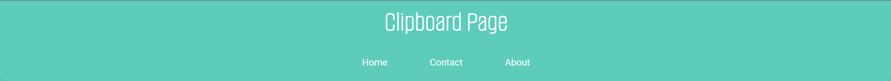
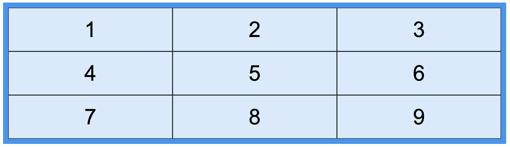

author: Natalia Solórzano, Bryan Flores, Douglas Hernández, Kevin Escobar, Erika Paz
summary: Laboratorio HTML y CSS
id: laboratorio01
tags: summary
categories: Educación, Herramientas Digitales, Programación WEB 2022
environments: Web
status: Published
feedback link: https://github.com/PW-UCA-Codes/PW-2022-Codelabs/issues

# Laboratorio 01 - HTML y CSS

## Introducción

Duration: 0:05:00

¿Qué aprenderás en este laboratorio?

1. Lo primero que veremos es la estructura HTML de los componentes semánticos de la página web, como header, sections, footer, entre otras.
2. Luego haremos el estilo con CSS, con diferentes características como padding, margin, color, flex, grid, entre otras.
3. Probaremos en cada slide del codelab una parte del diseño.
4. Debes seguir paso por paso para ir viendo de forma ordenada la forma de crear un sitio web responsive.

## Primeros Pasos

Duration: 0:10:00
| **Contexto** | **Descripción** |
| ------------------------------------------------------ | -------------------------------------------------------------------------------------------------------------------------------------------------------------------------------- |
| Clonar el repositorio de laboratorios | Entrar al espacio de eCampus con el link de repositorio del Classroom en Github y clonarlo |
| Descargar y descomprimir el .zip que contiene imágenes | Entrar a eCampus - Ir a Laboratorios y descargar la carpeta comprimida que tiene las imágenes a usar en el sitio web. Descomprimirlo dentro del repositorio que acaban de clonar |
| Estructura | Crear un directorio llamada **assets**, dentro copiar la carpeta de las imágenes, y crear los directorios **css**, **icons** e **images** |
| Archivos | Crear un archivo index.html |

```
├── README.md
├── assets
│   ├── css
│   │   └── style.css
│   ├── icons
│   │   ├── download-icon.svg
│   │   ├── favicon-32x32.png
│   │   ├── icon-blacklist.svg
│   │   ├── icon-facebook.svg
│   │   ├── icon-instagram.svg
│   │   ├── icon-preview.svg
│   │   ├── icon-text.svg
│   │   ├── icon-twitter.svg
│   │   ├── logo.svg
│   │   ├── menu.png
│   │   └── web.png
│   └── images
│       ├── bg-header-desktop.png
│       ├── bg-header-mobile.png
│       ├── grid-image-2.jpg
│       ├── grid-image-3.jpg
│       ├── grid-image-4.jpg
│       ├── grid-image-5.jpg
│       ├── grid-image-6.jpg
│       ├── grid-image.jpg
│       ├── image-computer.png
│       ├── image-devices.png
│       ├── logo-google.png
│       ├── logo-hp.png
│       ├── logo-ibm.png
│       ├── logo-microsoft.png
│       └── logo-vector-graphics.png
└── index.html
```

## MetaData

Duration: 0:10:00

Estructura base del **index.html** que sería nuestro primer paso para desarrollar nuestra página web.

Primera etiqueta **meta** con atributo **chartset** específica la codificación de caracteres para nuestro documento HTML.

```html
<meta charset="UTF-8" />
```

Segunda etiqueta **meta** permite que los autores web escojan cuál versión de Internet Explorer se debe de renderizar, por lo tanto, cuando el Internet Explorer encuentra la etiqueta meta **X-UA-Compatible**, comienza de nuevo con el motor de la versión designada. Este es un impacto en el rendimiento porque el navegador debe detenerse y reiniciarse para analizar el content con **IE=edge** que le dirá al Internet Explorer que muestre el contenido en el modo más alto posible.

```html
<meta http-equiv="X-UA-Compatible" content="IE=edge" />
```

Tercera etiqueta **meta** del **viewport** que permite que el **device-width** se asigne a la propiedad CSS de ancho, lo que esencialmente significa que los píxeles del dispositivo se asignan correctamente a los píxeles CSS, lo que permite que los elementos y las fuentes se escalen correctamente en los dispositivos móviles. Sin esto, un píxel no es un píxel en el sentido tradicional y para asegurarse de que nuestro sitio web se muestre correctamente en todos los dispositivos móviles, debemos de asegurarnos que en el content contenga cualquiera ya sea **width o initial-scale**, o por otro lado, **ambas**.

```html
<meta name="viewport" content="width=device-width, initial-scale=1.0" />
```

Después tenemos etiquetas **links** para definir la relación entre nuestro documento actual y un recurso externo, también se usa con mayor frecuencia para vincular hojas de estilo o para agregar un favicon a nuestra web.

Agregamos un icono a la pestaña de nuestro navegador con la siguiente etiqueta, donde **href** indica la ruta en la que se encuentra nuestra imagen, **sizes** las dimensiones de dicha imagen.

```html
<link rel="icon" type="image/png" sizes="16x16" href="./assets/icons/web.png" />
```

Para vincular nuestro archivo **style.css**, necesitamos hacerlo por medio de la etiqueta `&lt;link&gt;`

```html
<link rel="stylesheet" href="./assets/css/style.css" />
```

La etiqueta `&lt;title&gt;` que define el título de nuestra web que la mostrará en la pestaña de nuestro navegador.

```html
<title>Practica de Laboratorio 1</title>
```

Finalmente el `&lt;head&gt;` de nuestro archivo **.html** se verá de la siguiente manera:

```html
<!DOCTYPE html>
<html lang="en">
  <head>
    <meta charset="UTF-8" />
    <meta http-equiv="X-UA-Compatible" content="IE=edge" />
    <meta name="viewport" content="width=device-width, initial-scale=1.0" />
    <link
      rel="icon"
      type="image/png"
      sizes="16x16"
      href="./assets/icons/web.png"
    />
    <link rel="stylesheet" href="./assets/css/style.css" />
    <title>Practica de Laboratorio 1</title>
  </head>
  <body></body>
</html>
```

## Responsive Design

Duration: 0:10:00

El objetivo de un **diseño responsive** es construir páginas web que detecten el tamaño de la pantalla del usuario, y de acuerdo a ello el layout presente ciertos cambios.

Para crear un diseño responsive con **HTML** y **CSS** haremos uso de una técnica introducida en **CSS3** llamada **Media Query**. Se utiliza la regla **@media** la cual incluirá un bloque de propiedades que se aplicarán solo si cierta condición es verdadera.

Un término importante de conocer es **breakpoint** , como su nombre indica son ciertos puntos de quiebre donde nuestro diseño se comportará de una manera distinta. Los **breakpoints** más utilizados son los siguientes:

| Breakpoint prefix | Minimum width |
| ----------------- | ------------- |
| sm                | 640px         |
| md                | 768px         |
| lg                | 1024px        |

- **sm** corresponde al tamaño de pantallas para dispositivos móviles.

- **md** corresponde al tamaño de pantallas para tablets.

- **lg** corresponde al tamaño de pantallas de escritorio.

A continuación veremos un ejemplos de una **media query** en la cual cuando las dimensiones de la pantalla sean menores o iguales a 768px el color de fondo será de color **rojo**, caso contrario el color de fondo será de color **azul**.

```css
body {
  background-color: blue;
}

@media only screen and (max-width: 768px) {
  body {
    background-color: red;
  }
}
```

## Resultado a esperar

Duration: 0:05:00

Al finalizar este CodeLab tu página debería verse de la siguiente manera:


Y al ver tu página desde un dispositivo móvil se verá de la siguiente manera: 


## Configuración general del proyecto

Duration: 0:15:00

Para comenzar a dar estilo a nuestra página web debemos de escoger las fuente de texto que vamos a utilizar, en este caso utilizaremos las fuente de [Google Fonts](https://fonts.google.com/) que es es un directorio interactivo en el que puedes encontrar 923 familias de fuentes tipográficas de uso libre y completamente gratuito. En este caso escogimos la fuente **"Roboto"**, **"Montserrat"** y **"Alumni Sans Pinstripe"**. Para poderla utilizarlas en nuestra web copiamos el **@import** que nos genera google fonts y lo pegamos al inicio de nuestro archivo **CSS**.

```css
@import url("https://fonts.googleapis.com/css2?family=Alumni+Sans+Pinstripe&family=Montserrat&family=Roboto&display=swap");
```

Ahora para poder tener un estándar respecto a la paleta de colores que tendrémos en la web, harémos uso de las **variables CSS**, las cuales nos ayudaran a darles un identificador semántico a los colores a utilizar de manera que sea más facil de leer en el código y de utilizar. Para crear una variable CSS se sigue la sintaxis **--nombre-de-variable: valor;** y para poder utilizarlas se usa la función **var(--nombre-de-variable);**.

Por cierto el selector **:root** tiene mayor especificidad que el selector **html**

```css
:root {
  --theme-main-text: #4c555a;
  --theme-secondary-text: #7d8385;
  --theme-main-color: #5dccbb;
  --theme-button-one: #5dccbb;
  --theme-button-one-hover: #57af9e;
  --theme-button-two: #8795fe;
  --theme-button-two-hover: #7d86db;
  --theme-footer-bg: #f5f6f8;
}
```

Ahora al querer usar un color ya no tendremos que escribirlo en hexadecimal o RGB, podemos hacerlo por medio del nombre de la variable.

Seguidamente, es necesario establecer algunos estilos que queremos que tengan nuestros elementos html por defecto, ya que en ocasiones el navegador ya tiene algunos estilos.

Primero quitaremos el margin y padding de todos los elementos, a esto suele conocerse como un **reset** de estilos (Puedes ver un ejemplo de un CSS reset más completo [aquí](https://meyerweb.com/eric/tools/css/reset/)). Haciendo uso del selector universal **"\*"** y de los **pseudoelementos** **::after** y **::before**, haremos reset del **margin**, **padding** y nuestro **box-sizing** será **border-box**. También indicaremos que la fuente de toda nuestra página web será **"Roboto"**, en dado caso no encuentre a **"Roboto"** la fuente alternativa será **"sans-serif"**

```css
*,
*::after,
*::before {
  margin: 0;
  padding: 0;

  box-sizing: border-box;

  font-family: "Roboto", sans-serif;
}
```

Continuando con las configuraciones generales ahora todos nuestras etiquetas de encabezado harán uso de la fuente **Montserrat**, al igual que con **Roboto** nuestra fuente **fallback** o alternativa será **sans-serif**

```css
h1,
h2,
h3,
h4,
h5,
h6 {
  font-family: "Montserrat", sans-serif;
}
```

Seguidamente, a todas las secciones de nuestra página web, les indicaremos el width y height a utilizar, así como el padding donde haremos uso de la unidad de medida **rem** lo que será de mucha utilidad para que nuestro sitio sea adaptable a distintas pantallas.

Todas las secciones cumpliran con el modelo de diseño **flexbox**, con una orientación en columna.

```css
body > section {
  width: 100%;
  min-height: 100vh;

  padding: 4rem;

  display: flex;
  flex-direction: column;
}
```

Ahora a cada hijo **par** de las secciones tendrá un color distinto que los hijos **impares**, esto es posible gracias a **:nth-child(even)**.

```css
body > section:nth-child(even) {
  background: #eee;
}
```

## Header & NavBar

Duration: 0:15:00

### Header

El **header** solamente contendrá un `&lt;h1&gt;` en lo que se redacta sobre que es nuestra página web. Esto mejorará el **SEO** (Search Engine Optimization).

```html
<header>
  <!-- For SEO -->
  <h1>Clipboard Page</h1>
</header>
```

Primeramente seleccionaremos nuestro **header**, al cual le daremos un color de fondo con las variables globales que declaramos previamente, en este caso haremos uso de la variable **--theme-main-color** junto con la propiedad **z-index** lo que subirá el elemento visualmente sobre los demás. El indice indica la altura que lo subirá, a mayor indice mas alto estará.

```css
header {
  background-color: var(--theme-main-color);
  z-index: 10;
}
```

Ahora a la etiqueta `&lt;h1&gt;` donde su padre es **header**, le aplicaremos cierto **padding**, cambiaremos el **color de la fuente**, centraremos la fuente y usaremos la fuente **"Alumni Sans Pinstripe"**. La propiedad **user-select: none**, evita que el texto sea seleccionado.

```css
header > h1 {
  padding: 0.5rem;

  color: white;

  text-align: center;
  font-family: "Alumni Sans Pinstripe", sans-serif;
  font-size: 3rem;

  user-select: none;
}
```

### Nav

Usaremos la etiqueta `&lt;nav&gt;` la cual será utilizada como contenedor de nuestros vínculos de navegación. En nuestro nav haremos uso de una Unordered List con la etiqueta `&lt;ul&gt;` y su respectiva clase para posteriormente estilizar el aspecto.

```html
<nav>
  <ul class="nav-container"></ul>
</nav>
```

A la lista no ordenada le enlistaremos los items con `&lt;li&gt;` (list item) y por dentro de cada una, una etiqueta `&lt;a&gt;` que nos servirá como hipervínculo, y permitirá enlazarnos con una página a otra con su atributo más importante, un **href** que nos indicará el destino del vínculo. En este caso el destino solamente recargará nuestra página.

```html
<ul class="nav-container">
  <li><a href="">Home</a></li>
  <li><a href="">Contact</a></li>
  <li><a href="">About</a></li>
</ul>
```

Tambien dentro de nuestro **nav** haremos uso de la etiqueta `&lt;figure&gt;` y dentro de ella una imagen en la etiqueta `&lt;img&gt;`. El img contendrá un **id**, el source **src** donde se deberá especificar el **path** donde esté ubicada nuestra imagen, y finalmente el atributo **alt** contendrá el texto alternativo en dado caso no se pueda mostrar la imagen.

```html
<nav>
  ...
  <figure>
    
  </figure>
</nav>
```

Ahora procederemos a estilizar nuestro **nav** con **CSS**.

Haremos uso de un **position: sticky**, para mantener nuestra **NavBar** aún cuando hagamos scroll. Al usar un position es necesario utilizar las propiedades **top** y **left**.

Nuestro nav tendrá como color de background **(--theme-main-color)** y una sombra la cual ha sido dada con la propiedad **box-shadow**.

Con la propiedad **border-radius** redondearemos las partes inferiores de nuestro nav. Y al igual que en el header usaremos el **z-index** para subir visualmente el elemento.

```css
nav {
  position: sticky;
  top: 0;
  left: 0;

  background: var(--theme-main-color);
  box-shadow: 0px 2px 4px rgba(0, 0, 0, 0.1);

  border-radius: 0 0 1rem 1rem;
  z-index: 10;
}
```

Procederemos a darle estilo a la clase **nav-container**, haremos uso de **flexbox**, con **justify-content** posicionaremos los elementos horizontalmente dentro del **flex**, con **align-items** posicionaremos los elementos verticalmente dentro del **flex** y con **gap** indicaremos la distancia que tendrá cada uno de los elementos dentro del flex.

```css
.nav-container {
  display: flex;
  justify-content: center;
  align-items: center;
  gap: 1.5rem;
}
```

A cada etiqueta `&lt;li&gt;` que su padre sea **nav-container** le quitaremos el estilo que trae por defecto para solamente quedarnos con el texto.

```css
.nav-container > li {
  list-style: none;
}
```

A cada etiqueta `&lt;a&gt;` que se encuentren dentro del **nav-container** le indicaremos que su display sea **inline-block** para poder manipularlos horizontalmente, con un **padding** que permitirá que exista un espacio entre los elementos, de igual forma el color de la fuente será blanco y quitaremos toda decoración que nos brinda la etiqueta `&lt;a&gt;`

```css
.nav-container a {
  display: inline-block;
  padding: 1.5rem;

  color: white;
  text-decoration: none;
}
```

Ahora a todos los `&lt;li&gt;` dentro del **nav-container** al momento de pasar el mouse por encima de ellos cambiaran su color de fondo, dicho efecto será realizado con un transición de 0.3 segundos.

```css
.nav-container li:hover {
  background-color: var(--theme-button-one-hover);
  transition: all 0.3s ease-in-out;
}

#menu-icon {
  display: none;
}
```

Al finalizar esta sección tu header y navbar debería verse así:



## Section - Intro

Iniciamos con nuestro **body**, partimos con nuestra primera **section** con su id **intro** y esta sección va dirigida como la intro de la página.

```html
<section id="intro">
  ...
</section>
```

Dividimos la sección en diferentes contenidos, primero un **div** que será el contenedor de la imagen con su id y por dentro la respectiva **img** (imagen) con su id, el **src** donde le indicaremos la ruta donde está alojada la imagen y un **alt** que permite proporcionar un texto equivalente al objeto en dado caso no se logre cargar la imagen.

**Este div debe ir dentro de la sección intro**

```html
<div id="intro-img-container">
  <figure>
    
  </figure>
</div>
```

El segundo **div** que contendrá su respectiva clase **centered-elements** para hacer referencia que se centralizará el texto, **h1** para el encabezado y **p** para nuestro párrafo.

**Este div debe ir dentro de la sección intro**

```html
<div class="centered-quote">
  <h1>A history of everything you copy</h1>
  <p>
    Clipboard allows you to track and organize everything you copy. Instantly
    access your clipboard on all your devices.
  </p>
</div>
```

El último **div** de está sección tendrá su respectiva clase y será un contenedor para los botones, cada uno con su respectivo **ids**, para así poder manipularlos independientemente su contenido.

**Este div debe ir dentro de la sección intro**

```html
<div class="button-container">
  <button class="iOS-btn">Download for iOS</button>
  <button class="mac-btn">Download for Mac</button>
</div>
```

Continuaremos la web dando estilos al apartado "CSS intro" el cual está constituido por un banner con el logo de la web en el centro.

Primero debemos definir que la sección intro tenga **"justify-content: center"** y **"align-items: center"** para que podamos posicionar el logo en el centro tanto en el eje X, como en el eje Y.

Debe quedar de la siguiente manera:

```css
/* intro section */

#intro {
  justify-content: center;
  align-items: center;
}
```

También al contendor le agregaremos una imágen de fondo, dicha imágen abarcará todo el archo, por ende: **"width: 100%"** y **"padding: 3rem"**, para poder separalar **3rem** en todos sus ejes. Para posicionar al centro de acuerdo a la pantalla, se usa **"display:flex"** y se centra con **justify-content** y con **align-items**.

```css
/* Logo*/

#intro-img-container {
  width: 100%;
  padding: 3rem;

  display: flex;
  justify-content: center;
  align-items: center;
}
```

Finalmente, a la imágen dentro de nuestro contenedor le daremos valores de ancho y largo, serán **7rem**.

```css
#intro-img-container > figure {
  width: 7rem;
  height: 7rem;
}
```

Ahora a nuestras imágenes que cuenten con la clase **fluid**, su alto y ancho será de un 100%, y hacemos uso de un **object-fit: contain** para que la imágen mantenga relación de aspecto, pero se redimensione con respecto a su contenedor.

```css
/* fluid image */

img.fluid {
  width: 100%;
  height: 100%;
  object-fit: contain;
}
```

Seguidamente, teniamos un `&lt;div&gt;` el cual contiene un encabezado junto con un párrafo, a dicho `&lt;div&gt;` le aplicaremos un **padding**, un **flexbox** el cuál estará orientado verticalmente, para ello usamos **flex-direction: column**, y los centramos con **justify-content** y **align-items**. De igual manera, el texto deberá ir centrado, para ello hacemos uso de la propiedad **text-align**.

```css
/* Centered text */

.centered-quote {
  padding: 1rem;

  display: flex;
  flex-direction: column;
  justify-content: center;
  align-items: center;

  text-align: center;
}
```

A todas los encabezados `&lt;h1&gt;` y `&lt;h3&gt;` donde su padre sea la clase **centered-quote** le aplicaremos un margin vertical de **1rem** y quitaremos el margin horizontal, un color de fuente, su tamaño de fuente a **2.5rem** y una **font-weight: 700**, lo que la har, **bold - negrita**.

```css
.centered-quote > h1,
.centered-quote > h3 {
  margin: 1rem 0;

  color: var(--theme-main-text);
  font-size: 2.5em;
  font-weight: 700;
}
```

A todos las etiquetas `&lt;p&gt;` que su padre sea la clase **centered-quote** le aplicaremos un **width** del 100%, dicho párrafo no podrá ser mayor a 560px, con un margin vertical de **1rem** y horizontal de 0. Modificaremos el tamaño de la fuente y su color.

```css
.centered-quote > p {
  width: 100%;
  max-width: 560px;
  margin: 1rem 0;

  font-size: 1.5em;
  color: var(--theme-secondary-text);
}
```

Ahora a nuestro último **div** dentro de la sección **intro**, le aplicaremos un **padding**, un **flexbox**, con la propiedad **flex-flow** lo que nos beneficiará con respecto al **responsive design**, ya que se que si no caben los botones saltarán a la siguiente fila. Los centraremos con **justify-content** y con **align-items**, cada uno de los elementos del div estarán separados por un **gap** y su texto estará alineado hacia el centro.

```css
/* Android & IOS Buttons */

.button-container {
  padding: 2rem;

  display: flex;
  flex-flow: row wrap;
  justify-content: center;
  align-items: center;
  gap: 1rem;

  text-align: center;
}
```

A los **button** que su padre sea la clase **button-container** les daremos un **padding**, los haremos lucir un poco redondeados con **border-radius** y planos con un **border:none**. Modificaremos su fuente, color de fuente y peso, que será de 700, lo que implica que será **bold**.

```css
.button-container > button {
  padding: 1rem;

  border-radius: 2rem;
  border: none;

  font-size: 1rem;
  color: #fff;
  font-weight: 700;
}
```

Si recordamos dentro de nuestro div con la clase **button-container** tenemos dos botones, uno para iOS y otro para Mac. Procederemos a estilizar el botón para iOS. Cambiaremos su color de fondo.

```css
.button-container > .iOS-btn {
  background-color: var(--theme-button-one);
}
```

Y al momento de pasar el mouse sobre él nuestro cursor cambiará, al igual que su background, dicho cambio se realizará con una **transition** de 0.3 segundos.

```css
.button-container > .iOS-btn:hover {
  cursor: pointer;
  background-color: var(--theme-button-one-hover);
  transition: all 0.3s ease-in-out;
}
```

Al igual que con el botón anterior ahora a nuestro botón de **Download for Mac** le daremos un color de fondo.

```css
.button-container > .mac-btn {
  background-color: var(--theme-button-two);
}
```

Y al momento de pasar el mouse sobre él nuestro cursor cambiará, al igual que su background, dicho cambio se realizará con una **transition** de 0.3 segundos.

```css
.button-container > .mac-btn:hover {
  cursor: pointer;
  background-color: var(--theme-button-two-hover);
  transition: all 0.3s ease-in-out;
}
```

Finalmente nuestra sección **intro** debería verse de la siguiente manera:


## Section - Snippets

La siguiente sección con la que estaremos trabajando será la de **snippets**. Esta sección contendrá `&lt;div&gt;` con la clase que previamente le dimos estilo llamada **"centered-quote"**, un encabezado de `&lt;h3&gt;` con su texto y una etiqueta `&lt;p&gt;` para nuestro párrafo.

```html
<section id="snippets">
  <div class="centered-quote">
    <h3>Keep track of your snippets</h3>
    <p>
      Clipboard instantly stores any item you copy in the cloud, meaning you can
      access your snippets inmediately on all your devices. Our iOS and Mac apps
      will help you organize everything
    </p>
  </div>
</section>
```

Ahora corresponde aplicar estilos a la sección, ya que si recordamos el `&lt;div&gt;` ya tienen estilos debido a la clase **centered-quote**.

En esta primera parte, ponemos centrados los elementos del snippet con **"justify-content"**, **"align-items"** y centramos el texto con **"text-align"**

```css
/* Snippets */

#snippets {
  justify-content: center;
  align-items: center;

  text-align: center;
}
```

A los encabezados `&lt;h3&gt;` que sean hijos directos del id **snippets** les cambiaremos el color de la fuente utilizando la variable llamada **"--theme-main-text"**, se define el tamaño de la letra, el peso en 700 para aplicarle **bold** y un margin inferior de **2rem**

```css
#snippets > h3 {
  color: var(--theme-main-text);
  font-size: 2rem;
  font-weight: 700;
  margin-bottom: 2rem;
}
```

Ahora a todas las etiquetas `&lt;p&gt;` que sean hijos directos de **snippets**, cambiaremos su tamaño de fuente, su color de fuente, de aplicaremos un margin inferior y su anchura máxima será de un 40%.

```css
#snippets > p {
  font-size: 1.5rem;
  color: var(--theme-secondary-text);
  margin-bottom: 2rem;
  max-width: 40%;
}
```

Finalmente nuestra sección llamada **snippets** debería verse de la siguiente manera:


## Section - Features

En esta sección se muestran las características acerca de nuestra página web. Tendremos una sección principal la cual tendrá el id **features**.

```html
<section id="features">
  ...
</section>
```

Dentro de nuestra sección **features**, agregaremos otra sección llamada **side-left**, va a corresponder al lado izquierdo de nuestra sección principal.

**Este sección debe ir dentro de la sección features**

```html
<section id="side-left">
    ...
</section>
```

En la sección **side-left**, dentro de la etiqueta `&lt;figure&gt;` almacenaremos una imágen, dicha imágen tendrá la clase **fluid**, la explicación de la funcionalidad de está clase fue explicada previamente. En el **src** irá la ruta donde esté ubicada nuestra imágen y en el **alt** un texto alternativo en dado caso la imágen no pueda ser mostrada.

**Este figure debe ir dentro de la sección side-left**

```html
<figure>
  
</figure>

```

Seguidamente será necesario definir el lado derecho de nuestra sección **features**. Para ello haremos una nueva sección llamada **side-right**

```html
<section id="side-right">
  ...
</section>
```

Dentro de está sección tendremos tres distintos `&lt;div&gt;` los cuales harán referencia a las funcionalidad de nuestra **Clipboard Page**. El primer `&lt;div&gt;` que corresponde al feature **Quick Search** tendrá como clase **centered-qoute** y  contendrá un encabezado `&lt;h3&gt;` y una etiqueta `&lt;p&gt;` ambas con su respectivo texto.

```html
<div class="centered-quote">
  <h3>Quick Search</h3>
  <p>
    Easily search yor snippets by content, category, web address, aplication
    and more.
  </p>
</div>
```

Seguidamente crearemos otro `&lt;div&gt;` para el feature **iCloud Sync** en cual tendrá la clase **centered-quote** y dentro de el tendremos un `&lt;h3&gt;` y un `&lt;p&gt;`.

```html
<div class="centered-quote">
  <h3>iCloud Sync</h3>
  <p>Instantly saves and syncs snippets across all your devices.</p>
</div>
```

Finalmente, nuestro tercer `&lt;div&gt;` el cual contendrá la información sobre la feature **Complete History**, al igual que los dos anteriores tendrá como clase **centered-quote**, junto con un encabezado `&lt;h3&gt;` y un párrafo `&lt;p&gt;`

```html
<div class="centered-quote">
  <h3>Complete History</h3>
    <p>
    Retrieve any snippets from the first moment you started using the app.
    </p>
</div>
```

Con este deberíamos tener lista nuestra estructura **HTML** para la sección features

Para aplicar los estilos del apartado de **features**, es importante notar que este apartado está divido en dos secciones secundarias, la sección de la izquierda que contiene la imagen y la sección de la derecha que contiene texto.

Esta primera sección, contendrá las secciones **side-left** y **side-right**, estará centrada horizontalmente, para ello usamos **"justify-content"** y tendrá una separación entre sus elementos con un **"gap"** de 3 rem

```css
/* Features section */

#features {
  flex-direction: row;
  justify-content: center;
  gap: 3rem;
}
```

Las secciones que son hijas directas de la sección con id **features**, les aplicaremos **flew-grow** y **flex-shrink** de una sola vez, para ello usaremos **flex: 1**

```css
#features > section {
  flex: 1;
}
```

A la sección **side-left** que se encuentra dentro de **features** le aplicaremos **flexbox** y la centraremos con **justify-content** y **align-items**

```css
#features #side-left {
  display: flex;
  justify-content: center;
  align-items: center;
}
```

Ahora para la etiqueta `&lt;figure&gt;` que es hija directa de la sección **side-left** que a la vez **side-left** está dentro de **features**. Le aplicaremos una altura automática y un ancho del 100%, junto con un **position: relative** que hará que nuestra imágen se mueva con respecto a su posición inicial y un **left** del -25% para mover nuestro elemento hacia la izquierda desde donde se encuentra.

```css
#features #side-left > figure {
  width: 100%;
  height: auto;

  position: relative;
  left: -25%;
}
```

A nuestra sección **side-right** que se encuentra dentro de **features**, le aplicaremos un **flexbox** el cual vamos a orientar de manera vertical, para ello haremos uso de un **flex-direction: column**, lo centraremos horizontalmente con **justify-content** y cambiaremos su tamaño de fuente.

```css
#features #side-right {
  display: flex;
  flex-direction: column;
  justify-content: center;

  font-size: 0.8rem;
}
```

El resultado que deberíamos obtener al terminar nuestra sección debería ser el siguiente: 


## Section - Access

Procederemos a crear una nueva sección la cual será llamada con un id **access** y que tendrá la clase **centered-quote**

```html
<section id="access" class="centered-quote">
  ...
</section>
```

Dentro de esta sección tendremos un `&lt;div&gt;` que de igual forma hará uso de la clase **centered-quotes** y dentro de él una etiqueta de encabezado `&lt;h3&gt;` y una etiqueda de párrafo `&lt;p&gt;`

```html
<div class="centered-quote">
  <h3>Access Clipboard Anywhere</h3>
  <p>
    Whether you're on the go, or at your computer, you can access all your
    Clipboard snippets in a few simple clicks.
  </p>
</div>
```

Debajo de nuestro `&lt;div&gt;` que acabamos de añadir a la sección haremos uso de la etiqueta `&lt;figure&gt;` la cual contendrá una imágen con la clase **fluid**, la ruta donde se encuentra la imágen y un texto alternativo.

```html
<figure>
  
</figure>

```

Procederemos a darle estilo a nuestra sección **access** para que los elementos se centren horizontalmente haremos uso de **justify-content** y de la propiedad **"gap"** separar los elementos que se encuentren dentro.

```css
/* Access Section */

#access {
  justify-content: center;
  gap: 2rem;
}
```

Ahora a la `&lt;figure&gt;` que es hija directa de la sección **access** modificaremos el tamaño de la imágen a utilizar con **"width"** y el mínimo de ancho está puede tener con **"min-width"**

```css
#access > figure {
  width: 50%;
  min-width: 450px;
}
```

Al finalizar está sección el resultado debería de verse así:


## Section - Productivity

En esta parte tenemos una estructura donde estarán los elementos centrados en una cuadricula. Para posicionar las imágenes de esa forma, utilizaremos el módulo de **Diseño Grid** en CSS, que ofrece un sistema de ordenamiento de elementos basado en cuadrículas con filas y columnas; esto facilita el diseño de páginas web, evitando el uso de flotadores y posiciones.

Un caso de uso común para grid es la distribución del **viewport**, que en palabras sencillas es el pedazo visible de la pagina. Normalmente se divide el layout en 12 columnas, procurando su flexibilidad y adaptabilidad a distintas dimensiones. 

A continuación se presenta un ejemplo de un grid 3x3:



Otras de las dudas que pueden surgir al iniciar con HTML es el centrar elementos. Anteriormente, para el caso del texto, existía la tag `&lt;center&gt;`, que actualmente ya no es compatible con HTML5. Hoy en día esto se logra utilizando **CSS**, siendo **Grid Layout** una solución a dicho problema.

### Implementación de Grid - Estructura HTML

Continuando con la implementación del sitio web, se crea una sección con id **"productivity"**, donde colocaremos una cuadrícula flexible con imágenes. Además, le daremos un título para darle identidad visual a la sección.

```html
<section id="productivity">
  <h3>Be more productive</h3>
  ...
</section>

```

Dentro de la sección, crearemos el contenedor de las imágenes, al cual le asignaremos la clase **gird-container**, con el fin de generalizar su comportamiento en otros componentes similares.

```html
<div class="grid-container">
  ...
</div>

```

Dentro de este contenedor, colocaremos las imágenes a colocar en la cuadrícula. La metodología a seguir es similar a las imágenes fluidas: Se colocará un contenedor con la etiqueta `&lt;figure&gt;` ,  quien dará las medidas y el comportamiento de las imágenes; y dentro el `&lt;img&gt;` con la clase **grid-images**, que se encargará de renderizar la imagen como tal.

<aside class="negative">
  Recuerda verificar que los archivos de las imágenes se encuentren en tu directorio.
</aside>

```html
<figure>
  
</figure>
<figure>
  
</figure>
<figure>
  
</figure>
<figure>
  
</figure>
<figure>
  
</figure>
<figure>
  
</figure>
```

### Implementación de Grid - Estilos CSS

Ahora aplicaremos los estilos a esta sección. Por medio de los estilos haremos que el contenedor de las imágenes se comporte en forma de Grid, y permita reordenar los elementos. 

Antes, centraremos los elementos de la sección con respecto al eje principal.

```css
/* Productivity Section */

#productivity {
  justify-content: center;
}
```

Modificaremos el texto del titulo, definiendo un nuevo tamaño, peso, color y alineación.

```css
#productivity > h3 {
  padding: 1rem;

  color: var(--theme-main-text);
  font-size: 2.5em;
  font-weight: 700;
  text-align: center;
}
```
Para poder desplegar la cuadrícula de imágenes, haremos que nuestro contenedor sea de tipo **grid**. Para poder reutilizar esta configuración, se preparará la clase **grid-container** de forma genérica, unicamente cambiando su display.

```css
.grid-container {
  display: grid;
}
```
De forma mas específica, cambiaremos al contenedor dentro de la sección para definir los parámetros específicos de la cuadrícula.

Los aspectos mas importantes de este selector son los siguientes:

- *Estructura del grid*: Tanto las columnas como las filas se calcularán automáticamente, garantizando la flexibilidad de los contenedores, y estableciendo límites entre los distintos elementos presentes.
- *Estructura propia*: el tamaño del contenedor será dinámico, permitiendo crecer en el alto, y utilizando todo el espacio disponible en el ancho. Solo se limita el tamaño de este último, estableciendo un valor máximo. Además, se alineará individualmente al centro del eje cruzado de su contenedor; esto sin modificar el comportamiento de sus hermanos.

```css
#productivity .grid-container {
  width: 100%;
  max-width: 1024px;
  padding: 1rem;

  align-self: center;

  grid-template-columns: repeat(auto-fit, minmax(250px, 1fr));
  grid-auto-rows: minmax(250px, auto);
  grid-auto-flow: dense;

  gap: 3rem;
}
```

Para el manejo de las imágenes, configuraremos el `&lt;figure&gt;` de forma que se adapten a las necesidades que el contenedor de grid requiera. Además, se aplicará un radio a los bordes, para estilizar mas los elementos.


```css
#productivity .grid-container > figure {
  display: flex;

  border-radius: 2rem;
  overflow: hidden;
}
```

Por último, configuraremos las imágenes con un comportamiento similar a la clase **fluid**, pero estableciendo la adaptabilidad del objeto en cover.

```css
#productivity .grid-container .grid-images {
  width: 100%;
  height: 100%;
  object-fit: cover;
}
```
El resultado final será similar al presentado a continuación:


## Section - Tools

Antes de analizar la estructura es importante recalcar el uso de la semántica en HTML que se refiere al significado o información extra que otorgan los elementos o etiquetas del lenguaje, información que define o describe el contenido, función o sección que contienen.

Esta información es lo que permite que un documento se pueda rastrear de mejor manera. Ayuda a que el contenido se muestre de manera consistente en diferentes aplicaciones y contextos, además de ser fundamental para otorgar accesibilidad y funcionalidad con tecnología de asistencia como lectores de contenido. Es importante saber y entender cuando utilizar las etiquetas. Por ejemplo: Utilizar el `&lt;h1&gt;` para el título del artículo o página y `&lt;h2&gt;` a `&lt;h6&gt;` para dividir el contenido interno de acuerdo al esquema del documento.


Otro detalle adicional es la diferencia entre un ID y una clase, la cual consiste en el hecho de que una clase puede ser utilizado por varios elementos HTML, mientras que un ID solo debe ser utilizado por un elemento dentro de la página. Adicionalmente un ID sirve para hacer referencia, lo que permite que los lectores salten a partes especificas de un pagina web.

Crearemos una nueva sección a la cual le daremos el identificador único **tools**, dentro de ella colocaremos posteriormente las herramientas con las que contará nuestra página web.

```html
<section id="tools">
  ...
</section>
```

Primeramente, necesitaremos un `&lt;div&gt;` que usaremos para mostrar un encabeza y un párrafo. Dicho `&lt;div&gt;` usará la clase **centered-quote** para estilizar sus elementos.

```html
<div class="centered-quote">
  <h3>Supercharge your workflow</h3>
  <p>We've got the tools to boost your productivity.</p>
</div>
```

Seguidamente, después del **div** que acabamos de crear, añadiremos una nueva sección la cual contendrá toda la información correspondiente a las herramientas de nuestro **Clipboard**. Dicha sección tendrá un identificado único llamado **tools-info**

```html
<section id="tools-info">
  ...
</section>
```

Además, dentro de la sección **tools-info**, tendremos tres `&lt;div&gt;`, cada uno de ellos usará la clase **tool-item** para posteriormente ser estilizado. Contendrán un `&lt;figure&gt;` que a la vez tendrá una imágen, en la cual especificaremos la ruta en la que se encuentra y un texto alternativo, cabe recalcar que cada una de las imágenes tendrá la clase **fluid**. Tambien cada `&lt;div&gt;` tendrá encabezado `&lt;h4&gt;` y un `&lt;p&gt;`. La información y las imágenes serán diferentes en cada contenedor y será de acuerdo a las herramientas con las que cuenta nuestro **Clipboard**

```html
<div class="tool-item">
  <figure>
    
  </figure>
  <h4>Create blacklist</h4>
  <p>
    Ensure sensitive information never makes its way to your clipboard by
    excluding certain sources.
  </p>
</div>

<div class="tool-item">
  <figure>
    
  </figure>
  <h4>Plain text snippets</h4>
  <p>
  Remove unwanted formatting from copied text for a consistent look.
  </p>
</div>

<div class="tool-item">
  <figure>
    
  </figure>
  <h4>Sneak preview</h4>
  <p>Quick preview of all snippets on your Clipboard for easy access.</p>
</div>
```

A continuación, aplicaremos los estilos a la sección principal llamada "tools", centraremos los elementos horizontalmente y los distanciaremos una unidad relativa.

```css
/* Tools section */

#tools {
  justify-content: center;
  gap: 1rem;
}
```

A la sección interna **tools-info** la cual está dentro de **tools**, le aplicaremos **flexbox**, con la propiedad **wrap** haremos que los elementos pasen a la siguiente fila si ya no caben en pantalla. Los elementos estarán centrados tanto horizontalmente como verticalmente, también aplicaremos un distanciamento de dos unidades relativas, y todo el texto dentro de nuestra sección estará centrado.  

```css
#tools-info {
  display: flex;
  flex-wrap: wrap;
  justify-content: center;
  align-items: center;
  gap: 2rem;

  text-align: center;
}
```

Cada ítem dentro de la sección **tools-info**, tendrá una anchura y altura de 20rem con un padding de 2rem. Aplicaremos el diseño de caja flexible **flex** el cual estará posicionado como columna, con sus elementos centrados vertical y horizontalmente. Además, dichos elementos estarán redondeados gracias a **border-radius: 50%** y lucirán planos debido a **border: none**. El color de fondo de dichos elementos será blanco. Al momento de pasar el mouse sobre cada elemento veremos como cambia nuestro puntero. Y si el contenido no cabe será recortado, por eso usamos **overflow: hidden**, así no se mostrará un **scroll**.

```css
.tool-item {
  width: 20rem;
  height: 20rem;
  padding: 2rem;

  display: flex;
  flex-direction: column;
  justify-content: center;
  align-items: center;
  gap: 1.5rem;

  border-radius: 50%;
  border: none;

  background-color: #fff;
  cursor: pointer;
  overflow: hidden;
}
```

A cada `&lt;figure&gt;` que sea hijo directo de **tool-item** le daremos un alto y ancho de 44px.

```css
.tool-item > figure {
  width: 44px;
  height: 44px;
}
```

A los título `&lt;h4&gt;` que sean hijos directos de la clase **tool-item**, cambiaremos su tamaño y su color de fuente.

```css
.tool-item > h4 {
  font-size: 1.5rem;
  color: var(--theme-main-text);
}
```

Y al igual que hicimos con los encabezados `&lt;h4&gt;`, ahora a los párrafos `&lt;p&gt;` que son hijos directos de la clase **tool-item**, también les modificaremos su tamaño de fuente y color de fuente.

```css
.tool-item > p {
  font-size: 1.1rem;
  color: var(--theme-secondary-text);
}
```

Al terminar la sección **tools**, deberías poder ver el siguiente resultado:


## Section - Sponsors

Esta sección es bastante corta ya únicamente nos servirá como contenedor de una serie de imágenes, le daremos un identificador único al que llamaremos como **sponsors**

```html
<section id="sponsors">
  ...
</section>
```

Seguidamente, dentro de dicha sección, agregaremos cinco imágenes cada una dentro de un `&lt;figure&gt;` el cual se comportará según indique la sección **sponsors**, y cada `&lt;img&gt;` hará uso de la clase **fluid**, dicha clase hará que la imágen mantega su relación de aspecto pero con la cualidad de que se redimensionará de acuerdo al tamaño de pantalla.

```html
<figure>
  
</figure>
<figure>
  
</figure>
<figure>
  
</figure>
<figure>
  
</figure>
<figure>
  
</figure>

```

Centraremos dicha sección tanto horizontalmente como verticalmente, recordando que ya cuenta con la propiedad **flex**, para ello usaremos **align-items** y **justify-content**, nuestro **flex** se mostrará en filas y en dado caso los elementos no quepan en pantalla se irán a la siguiente fila, para hacer eso posible usamos **wrap**, **align-content** hará que cuando tengamos más de una fila los elementos estén centrados verticalmente y la propiedad **gap** nos permitirá tener un espaciado entre elementos.

```css
/* Sponsors Section */
#sponsors {
  align-items: center;
  align-content: center;
  justify-content: center;
  flex-flow: row wrap;
  gap: 4rem;
}
```

Para etiqueta `&lt;figure&gt;` que sea hija directa de la sección **sponsors** le daremos un ancho de **7.5rem**

```css
#sponsors > figure {
  width: 7.5rem;
}
```

Finalmente, tu sección **sponsors** lucirá de está manera:


## Section - Clip

Esta será nuestra última sección antes de llegar al **footer**, dicha sección tendrá el identificador único **clip** y hará uso de la clase **centered-quote**

```html
<section id="clip" class="centered-quote">
  ...
</section>
```

Ahora dentro de la sección **clip** procederemos a crear un `&lt;div&gt;` que se encargará de contener un encabezado y un párrafo. Dicho `&lt;div&gt;` usará la clase **centered-quote** la cual ha sido estilizada previamente.

```html
<div class="centered-quote">
  <h3>Clipboard for iOS and MacOS</h3>
  <p>
    Available for free on the App Store. Download for Mac or iOSsync with
    iCloud and you're ready to start adding to your clipboard.
  </p>
</div>
```

Siempre dentro de la sección **clip**, crearemos un nuevo `&lt;div&gt;` donde colocaremos dos botones, uno que indicará **Download for iOS** y otro para **Download for Mac**. Dicho **div** hará uso de la clase que previamente estilizamos llamada **button-container**. Dentro de esté contenedor tendremos los dos botones, cada uno con su respectiva clase.


```html
<div class="button-container">
  <button class="iOS-btn">Download for iOS</button>
  <button class="mac-btn">Download for Mac</button>
</div>
```

Centraremos la sección **clip** tanto horizontalmente como verticalmente, por ende haremos uso de **justify-content** y **align-items**.

Finalmente el **CSS** para la sección **clip** se verá de la siguiente manera:


```css
/* Clip section */

#clip {
  justify-content: center;
  align-items: center;
}
```

Al finalizar está sección deberías visualizar el siguiente resultado:


## Footer

Por último, tenemos la estructura del footer, que se define como el pie de página para un documento o sección. Un footer normalmente contiene:

- Información sobre los autores
- Información sobre los derechos de autor
- Información de contacto
- Mapa del sitio
- Enlaces para volver al inicio de la página
- Documentos relacionados
- Redes sociales

Ejemplo de un footer:


En la sección **Reflexión final** se te presentará un reto con respecto a la creación de un **footer**

## Estructura de CSS Responsive

Duration: 0:20:00

Para lograr que nuestra página web sea responsive haremos uso de **media queries**, ya que apartir de estas podemos incluir un bloque de propiedades CSS en un determinado elemento a partir del cumplimiento de condiciones como la resolución de la pantalla o el ancho del navegador.

Para aplicar una **media query**, se debe especificar a partir de una o más expresiones las caracteristicas de resolución o tamaño. En nuestro caso será mucho más fácil lograr que nuestra página web sea responsive debido a que hemos utilizado módulos de diseño como Flex y Grid, los cuales nos favorecen al momento de hacer nuestra página web responsive.

El primer breakpoint con el que vamos a trabajar será a 1024px - **[lg]**. Para ello haremos uso de la siguiente **media query**, y en su interior irán las nuevas instrucciones de **css** para pantallas que cumplan con la característica de ser menores o iguales a 1024px.
```css
@media screen and (max-width: 1024px) {
  ...
}
```

Cambiaremos la orientación de la sección features a vertical, para ello aplicaremos **flex-direction: column**
```css
#features {
  flex-direction: column;
}
```

La `&lt;figure&gt;` que es hija directa de **side-left** y a la vez **side-left** está dentro de **features**, la regresaremos a su posición inicial con **left: 0** y ahora su ancho será de un 75%

```css
#features #side-left > figure {
  left: 0;
  width: 75%;
}
```

La siguiente **media query** hará efecto cuando las dimensiones sean menores o iguales a 768px - **[md]**, y dentro de ella las respectivas instrucciones de **css**

```css
@media screen and (max-width: 768px) {
  ...
}
```

Dentro de está **media query** el primer cambio que surgirá será a todas las secciones que son hijas directas de nuestros **body**, ahora nuestro **padding** será de **1rem**

```css
body > section {
  padding: 1rem;
}
```

Cuando en tamaños de pantallas menores o iguales a 768px comunmente se están utilizando tablets, por ende cambiaremos nuestro nav bar. Ocultaremos nuestro **nav-container**

```css
/* Hamburger button display */
.nav-container {
  display: none;
}
```

De igual manera ocultaremos nuestro **header** el cual contenía el texto de **Clipboard Page**

```css
header {
  display: none;
}
```

Y a nuestro **nav** le agregaremos un espacio de rellenos tanto horizontal como vertical con **padding**

```css
nav {
  padding: 1.5rem;
}
```

Es momento de mostrar el ícono de **hamburguer menu** que inicialmente estaba oculto, para ello haremos un **display: block** y le daremos una altura y ancho con la medida relativa **rem**


```css
#menu-icon {
  display: block;
  height: 1.5rem;
  width: 1.5rem;
}
```

Y finalmente nuestro último **breakpoint** que estará a los 640px - **[sm]**, que comúnmente es utilizado para dispositivos móviles, cuando el tamaño de la pantalla sea menor o igual a 640px dichos cambios harán efecto

```css
@media screen and (max-width: 640px) {
  ...
}
```

Haremos uso del selector **:root** y únicamente modicaremos el tamaño de la fuente de toda nuestra página web.

```css
:root {
  font-size: 0.75rem;
}
```

##  Glosario de CSS

Duration: 0:05:00

| **Contexto**          | **Descripción**                                                                                                                             |
| --------------------- | ------------------------------------------------------------------------------------------------------------------------------------------- |
| --variable: #4c555a;  | Permite crear variables dentro del .css                                                                                                     |
| margin                | Establece el área de margen en los cuatro lados de un elemento                                                                              |
| padding               | Establece el área de relleno en los cuatro lados de un elemento a la vez                                                                    |
| font-family           | Especifica familias fuentes para el elemento seleccionado                                                                                   |
| display               | Establece un elemento de bloque o línea con grid, flex, o flow layout                                                                       |
| justify-content       | Define como distribuir el espacio entre los elementos                                                                                       |
| align-items           | Estable el valor de los hijos del grupo, la alineación de bloque                                                                            |
| background            | Permite definir imagen, color, tamaño o posición del fondo                                                                                  |
| box-shadow            | Le agrega el efecto de sombra alrededor del marco del elemento                                                                              |
| position              | Establece la posición de un elemento con top, right, bottom y left                                                                          |
| top                   | Posición vertical, con posición absoluta, hacia arriba                                                                                      |
| left                  | Posición horizontal, con posición absoluta, hacia izquierda                                                                                 |
| list-style            | Le pone estilo lista a los elementos seleccionados, y se puede quitar con none                                                              |
| color                 | Le da valor de color, que puede usarse con propiedades como border-color                                                                    |
| text-decoration       | Le brinda color, font, line, al texto seleccionado                                                                                          |
| hover                 | Es una propiedad que le brinda estilo a los elementos seleccionados, haciéndolos de otro color                                              |
| width                 | Propiedad que establece el ancho de un elemento                                                                                             |
| height                | Propiedad que establece la altura de un elemento                                                                                            |
| background-size       | Establece el tamaño de la imagen de fondo del elemento                                                                                      |
| background-position   | Establece la posición inicial de cada imagen de fondo                                                                                       |
| background-image      | Establece una o más imágenes de fondo en un elemento                                                                                        |
| flex-direction        | Establece cómo se colocan los elementos flexibles en el contenedor flexible que define el eje principal y la dirección (normal o invertida) |
| text-align            | Establece la alineación horizontal del contenido de nivel en línea dentro de un elemento de bloque o cuadro de celda de tabla               |
| font-size             | Establece el tamaño de la fuente                                                                                                            |
| font-weight           | Establece el peso (o negrita) de la fuente                                                                                                  |
| max-width             | Establece el ancho máximo de un elemento                                                                                                    |
| border                | Establece el borde de un elemento                                                                                                           |
| cursor                | Establece el cursor del ratón, si lo hay, para mostrar cuando el puntero del mouse está sobre un elemento                                   |
| transition            | Establece el efecto de cambio, por ejemplo, el tiempo de transición                                                                         |
| gap                   | Establece espacios entre filas y columnas                                                                                                   |
| grid-template-columns | Define el tamaño entre columnas de la cuadrícula                                                                                            |
| grid-auto-rows        | Especifica el tamaño de fila en la cuadrícula                                                                                               |
| grid-auto-flow        | Controla el algoritmo de la colocación automática de los elementos de la cuadrícula                                                         |
| object-fit            | Ajusta el cambio de tamaño del contenido de un elemento en su contenedor, usado para responsive                                             |
| vertical-align        | Establece la alineación vertical de un cuadro de línea, de bloque o celda                                                                   |

## Reflexión final

Duration: 0:35:00

### Conclusiones

* En este CodeLab tuviste un acercamiento con la estructura **HTML** de una página web, como se definen las clases o Id's a las secciones para posteriormente estilizarlas con **CSS**.

* Una manipulación más profunda de **CSS** con:
  - Variables globales para los colores
  - Hovers
  - Uso de diferentes selectores
  - Manejo de flexbox para posicionamiento unidimensional
  - Manejo de grid para posicionamiento multidimensional 
  - Posicionamiento de elementos con sticky, relative y absolute
  - Diseño responsive con **Media Query**
  - Uso de medidas relativas

### Actividad

- Al finalizar la parte guiada de este CodeLab debes subir tu avance a tu **Portafolio** de GitHub para poder calificarlo

### Ejercicio propuesto

A continuación tendrás el código **HTML** para crear tu **footer**: 

```html
<footer>
    <figure id="footer-img">
      
    </figure>

    <section class="grid-container" id="footer-links">
      <a href="#">FAQs</a>
      <a href="#">Contact Us</a>
      <a href="#">Privacy Policy</a>
      <a href="#">Press Kit</a>
      <a href="#">Install Guide</a>
    </section>

    <section id="social-media">
      <a target="_blank" href="https://www.facebook.com">
        <svg class="social-media-icon" width="24" height="24" xmlns="http://www.w3.org/2000/svg">
          <path
            d="M22.675 0H1.325C.593 0 0 .593 0 1.325v21.351C0 23.407.593 24 1.325 24H12.82v-9.294H9.692v-3.622h3.128V8.413c0-3.1 1.893-4.788 4.659-4.788 1.325 0 2.463.099 2.795.143v3.24l-1.918.001c-1.504 0-1.795.715-1.795 1.763v2.313h3.587l-.467 3.622h-3.12V24h6.116c.73 0 1.323-.593 1.323-1.325V1.325C24 .593 23.407 0 22.675 0z" />
        </svg>
      </a>

      <a target="_blank" href="https://www.twitter.com">
        <svg class="social-media-icon" width="24" height="24" xmlns="http://www.w3.org/2000/svg">
          <path
            d="M24 2.557a9.83 9.83 0 01-2.828.775A4.932 4.932 0 0023.337.608a9.864 9.864 0 01-3.127 1.195A4.916 4.916 0 0016.616.248c-3.179 0-5.515 2.966-4.797 6.045A13.978 13.978 0 011.671 1.149a4.93 4.93 0 001.523 6.574 4.903 4.903 0 01-2.229-.616c-.054 2.281 1.581 4.415 3.949 4.89a4.935 4.935 0 01-2.224.084 4.928 4.928 0 004.6 3.419A9.9 9.9 0 010 17.54a13.94 13.94 0 007.548 2.212c9.142 0 14.307-7.721 13.995-14.646A10.025 10.025 0 0024 2.557z" />
        </svg>
      </a>

      <a target="_blank" href="https://www.instagram.com">
        <svg class="social-media-icon" width="24" height="24" xmlns="http://www.w3.org/2000/svg">
          <path
            d="M12 2.163c3.204 0 3.584.012 4.85.07 3.252.148 4.771 1.691 4.919 4.919.058 1.265.069 1.645.069 4.849 0 3.205-.012 3.584-.069 4.849-.149 3.225-1.664 4.771-4.919 4.919-1.266.058-1.644.07-4.85.07-3.204 0-3.584-.012-4.849-.07-3.26-.149-4.771-1.699-4.919-4.92-.058-1.265-.07-1.644-.07-4.849 0-3.204.013-3.583.07-4.849.149-3.227 1.664-4.771 4.919-4.919 1.266-.057 1.645-.069 4.849-.069zM12 0C8.741 0 8.333.014 7.053.072 2.695.272.273 2.69.073 7.052.014 8.333 0 8.741 0 12c0 3.259.014 3.668.072 4.948.2 4.358 2.618 6.78 6.98 6.98C8.333 23.986 8.741 24 12 24c3.259 0 3.668-.014 4.948-.072 4.354-.2 6.782-2.618 6.979-6.98.059-1.28.073-1.689.073-4.948 0-3.259-.014-3.667-.072-4.947-.196-4.354-2.617-6.78-6.979-6.98C15.668.014 15.259 0 12 0zm0 5.838a6.162 6.162 0 100 12.324 6.162 6.162 0 000-12.324zM12 16a4 4 0 110-8 4 4 0 010 8zm6.406-11.845a1.44 1.44 0 100 2.881 1.44 1.44 0 000-2.881z" />
        </svg>
      </a>
    </section>
  </footer>
```

Tu reto es estilizarlo con **CSS** para que se vea de la siguiente manera, recuerda que puede hacer uso de **flex**, **grid**, **:hover** y **position**

Exitos!

