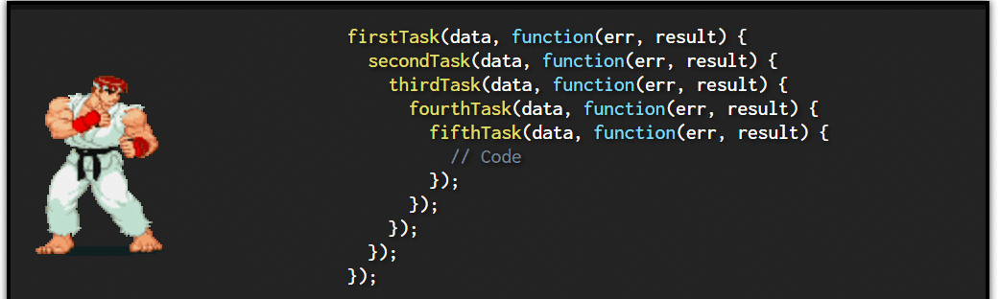

author: Natalia Solórzano, Bryan Flores, Leonardo Albiñana, Kevin Escobar, Erika Quinteros
summary: Laboratorio JavaScript
id: laboratorio02
tags: summary
categories: Educación, Herramientas Digitales, Programación WEB 2022
environments: Web
status: Published
feedback link: https://github.com/PW-UCA-Codes/PW-2022-Codelabs/issues

# Laboratorio 02 - JavaScript

## Introducción

Duration: 0:05:00

### ¿Qué es JavaScript?

JavaScript es un lenguaje de programación multiplataforma orientado a objetos que se utiliza para hacer que las páginas web sean interactivas. Por ejemplo: que tengan animaciones complejas, botones en los que se puede hacer clic, menús emergentes, etc.


Los programas en este lenguaje se denominan scripts . Se pueden escribir directamente en el HTML de una página web y ejecutarse automáticamente a medida que se carga la página.

Los scripts se proporcionan y ejecutan como texto sin formato. No necesitan preparación especial o compilación para funcionar.

También hay versiones de JavaScript de lado del servidor más avanzadas, como Node.js, que permiten agregar más funcionalidad a un sitio.

JavaScript contiene una biblioteca estándar de objetos, como Array, Date y Math, y un conjunto básico de elementos del lenguaje como operadores, estructuras de control y declaraciones. El núcleo de JavaScript se puede extender para una variedad de propósitos completándolo con objetos adicionales; por ejemplo:

- JavaScript de lado del cliente extiende el núcleo del lenguaje al proporcionar objetos para controlar un navegador y su Modelo de objetos de documento (DOM por Document Object Model). Por ejemplo, las extensiones de lado del cliente permiten que una aplicación coloque elementos en un formulario HTML y responda a eventos del usuario, como clicks del mouse, formularios para ingreso de datos y navegación de páginas.dom


- JavaScript de lado del servidor amplía el núcleo del lenguaje al proporcionar objetos relevantes para ejecutar JavaScript en un servidor. Por ejemplo, las extensiones de lado del servidor permiten que una aplicación se comunique con una base de datos, brinde continuidad de información de una invocación a otra de la aplicación o realice manipulación de archivos en un servidor.


En palabras mas simples, en el navegador, JavaScript puede cambiar la apariencia de la página web (DOM). Y, del mismo modo, el JavaScript de Node.js en el servidor puede responder a solicitudes personalizadas desde el código escrito en el navegador.

Lo antes mencionado relacionado con lo estudiado hasta el momento puede resumirse con la siguiente imagen: 


Podemos pensar en HTML como el esqueleto, CSS la piel y JavaScript el cerebro.

### JavaScript y Java
Es bastante importante recalcar que JavaScript y Java no son lo mismo pero si similares en algunos aspectos. Algunas de las diferencias mas importantes a destacar son las siguientes:

| JavaScript                                                                                                                                                                                                     | Java                                                                                                                                                                                                                |
| -------------------------------------------------------------------------------------------------------------------------------------------------------------------------------------------------------------- | ------------------------------------------------------------------------------------------------------------------------------------------------------------------------------------------------------------------- |
| Orientado a objetos. No hay distinción entre tipos de objetos. La herencia se realiza a través del mecanismo de prototipo, y las propiedades y métodos se pueden agregar a cualquier objeto de forma dinámica. | Basado en clases. Los objetos se dividen en clases e instancias con toda la herencia a través de la jerarquía de clases. Las clases y las instancias no pueden tener propiedades o métodos agregados dinámicamente. |
| Los tipos de datos de las variables no se declaran (tipado dinámico, tipado flexible).                                                                                                                         | Los tipos de datos de las variables se deben declarar (tipado estático, fuertemente tipado).                                                                                                                        |
| No se puede escribir automáticamente en el disco duro.                                                                                                                                                         | Puede escribir automáticamente en el disco duro.                                                                                                                                                                    |


### ¿Qué hace que JavaScript sea único?

Hay al menos tres cosas geniales sobre JavaScript:
- Integración completa con HTML/CSS.
- Las cosas simples se hacen simplemente.
- Compatible con todos los principales navegadores y habilitado de forma predeterminada.

JavaScript es la única tecnología de navegador que combina estas tres cosas. Dicho esto, JavaScript se puede utilizar para crear servidores, aplicaciones móviles, etc.

## Primeros Pasos

Duration: 0:05:00

1. Clonar tu repositorio `portafolio`
2. Dentro de tu `portafolio` en el directorio `Laboratorios` crear una nueva carpeta llamada `Laboratorio-02`. La estructura de dicha carpeta será la siguiente:

```
Laboratorio-02
    ├── guided
    │   └── ...
    └── proposed
        └── ...
```

3. En la carpeta llamada `guided` deberás realizar los ejercicios guiados
4. En la carpeta llamada `proposed` deberás realizar los ejercicios propuestos

## Instalaciones Necesarias

Duration: 0:05:00

Para la ejecución de los programas realizados en JavaScript es necesario tener instalado el [Node Version Manager](https://github.com/nvm-sh/nvm) con la versión más reciente de [Node](https://nodejs.org/es/).

Para comprobar la versión de `nvm`, ejecuta el siguiente comando en tu consola:

```
nvm -v
```

Para comprobar tu versión de `node`, ejecuta en tu consola:

```
node -v
```

Para ejecutar los programas realizados durante este laboratorio se hará de la siguiente manera

```
node <nombreArchivo>.js
```

## HOF - Callbacks

Duration: 0:10:00

### Callbacks

En JavaScript hay ciertas situaciones que no será posible manejarlas de manera **síncrona**, es decir, que una operación se ejecute luego de que la otra haya terminado. Esto puede ocurrir al momento de solicitar datos de fuentes externas, ya que se desconoce cuanto tiempo tardará dicha fuente en brindar una respuesta. En dichas situaciones detener la ejecución de todo el programa no es una solución eficiente. No obstante, JavaScript permite que cierto procesos se ejecuten de manera **asíncrona**, es decir, que dos o más procesos sucedan al mismo tiempo. Para dichas situaciones el uso de los **Callbacks** puede resultar útil.

JavaScript permite que una función pueda ser el argumento de otra función para ser "llamada de nuevo" (_Callback_) posteriormente. A las funciones que tienen como argumento otra función se les conoce como **funciones de orden superior** (_High Order Functions_).

A continuación, se creará un arreglo de objetos llamado `champs`, en cuál tendrá el `id`, `name` y `title` de los campeones a utilizar.

```javascript
const champs = [
  {
    id: 1,
    name: "Warwick",
    title: "The Blood Hunter",
  },
  {
    id: 2,
    name: "Ahri",
    title: "The Nine-Tailed Fox",
  },
  {
    id: 3,
    name: "Jhin",
    title: "The Virtuoso",
  },
];
```

Seguidamente se creará otro arreglo de objetos que contendrá los items con los que cuenta cada campeón. Dichos items cuentan con su `id`, `name` y `cost`.

```javascript
const items = [
  {
    id: 1,
    name: "Sheen",
    cost: 700,
  },
  {
    id: 2,
    name: "Needlessly Large Rod",
    cost: 1300,
  },
];
```

Ya que los arreglos a utilizar han sido creados, es necesario definir una función para obtener los campeones por medio de su `id`. Dicha función recibirá como argumento el `id` del campeón y una `función` que será llamada `callback` (el nombre de la función puede variar).

```js
const getChampById = (id, callback) => {};
```

Dentro de dicha función se creará una variable llamada `champ`, la cuál contendrá al campeón cuyo `id` sea el mismo que ha sido enviado como argumento. Esta verificación se realizará haciendo uso del método `find`, dicho método retorna el primer valor de un arreglo que cumple con las condiciones establecidas.

```js
const champ = champs.find((champ) => champ.id === id);
```

Será necesario verificar si fue encontrado algún campeon con el `id` enviado, para ello se hará uso de un `if`. Si la variable `champ` se encuentra vacía, el argumento de la función será un `string` que indique que no hay un campeón con el `id` brindado.

```js
if (!champ) {
  callback(`No champ with id ${id}`);
}
```

Caso contrario, si se obtuvo un campeón con el `id` brindado, a la función `callback` se enviará como primer argumento `null` que indica que no sucedio ningun error, y como segundo argumento el `champ` que cumple con las condiciones establecidas.

```js
else {
    callback(null, champ);
}
```

Seguidamente, es necesario crear una función que permita obtener la información que se encuentra en el arreglo `items`. Dicha función será llamada `getItemById` y recibirá como argumento el `id` del item y una `función` que será llamada `done`.

```js
const getItemById = (id, done) => {};
```

Al igual que con el arreglo de `champs`, se necesita verificar si fue encontrado algun `item` en el arreglo `items` con el `id` que fue enviado. Para realizar dicha comprobación se procede a hacer uso del método `find`.

```js
const item = items.find((item) => item.id === id);
```

Si no se encontró ningún `item` es necesario enviar un mensaje como `string` a la función `done`, que indique que no fue encontrado un `item` con el `id` proporcionado.

```js
if (!item) {
  done(`No item with id ${id}`);
}
```

Si la variable `item` no está vacía se procede a hacer uso de la función `done`, enviandole como primer argumento `null` ya que no ha ocurrido ningun error, y la variable `item` como segundo argumento, debido a que previamente se verificó que tiene información.

```js
else {
    done(null, item);
}
```

Será necesario declarar una variable que será llamada `id`, dicha variable se estará enviando como argumento a las funciones previamente creadas

```js
const id = 1;
```

A continuación se procede a llamar a la función `getChampById`, dicha función recibe como primer argumento el `id` del campeón, y como segundo argumento una `arrow function` la cual tiene como primer argumento `err` que indicará que no ha sido encontrado un `champ` con el `id` enviado, y como segundo argumento el `champ` que contiene el `id`, `name` y `title`.

```js
getChampById(id, (err, champ) => {});
```

Dentro de la `arrow function` se verificará si ha sido enviado `err`, y si es así se procede a terminar la ejecución de la función retornando un mensaje con la información que contenga `err`.

```js
if (err) {
  return console.log(`Warning: ${err}`);
}
```

Si el argumento `err` fue enviado como `null` indica que no ha ocurrido ningún error y que nuestra variable `champ` tiene información. Ahora será necesario llamar a la función `getItemById` siempre dentro de la `arrow function`. Dicha función recibirá como primer argumento el `id` del item, y como segundo argumento una `arrow function`, la cuál tendrá como primer argumento `err`, y como segundo argumento `item`.

```js
getItemById(id, (err, item) => {});
```

Al igual que se realizó con la función `getItemById`, es necesario verificar si ha sido enviado `err`. Si es así se procede a terminar la ejecución de la función y retornar el mensaje de error.

```js
if (err) {
  return console.log(`Warning: ${err}`);
}
```

Si el argumento `err` fue enviado como `null` indica que no sucedió ningún error y es posible mostrar la información tanto del `champ` como del item `item` que hayan hecho `match` con el `id` proporcionado.

```js
console.log(
  `${champ.title} - ${champ.name} has a ${item.name} which costs ${item.cost} gold.`
);
```

A dicha anidación de Callbacks se le conoce como `Callback Hell`, mientras más funciones anidadas existan, el código se vuelve cada vez menos y menos legible.



El resultado luego de haber ejecutado el programa con el `id = 1` muestra la información tanto del campeón como del item.

```
The Blood Hunter - Warwick has a Sheen which costs 700 gold.
```

Al igual que en el caso anterior, al ejecutar el programar con el `id = 2`, también se muestra la información tanto del `champ` como del `item`.

```
The Nine-Tailed Fox - Ahri has a Needlessly Large Rod which costs 1300 gold.
```

Al ejecutar el programa con el `id = 3` el mensaje de error indica que no hay un `item` con dicho `id`. El mensaje fue mostrado ya que si existe un `champ` con dicho `id`.

```
Warning: No item with id 3
```

Finalmente, el resultado para el `id = 4` indica que no se ha encontrado un `champ` con dicho `id`. Esto ocurre ya que el error fue encontrado antes de entrar a la función `getItemById` por ende, no se muestra información respecto a algún `item`.

```
Warning: No champ with id 4
```

## HOF - Promises

Duration: 0:10:00

### Promises

Una manera de lidiar con el `Callback Hell` es hacer uso de las promesas. Una `Promise` representa la eventual finalización (o falla) de una operación asíncrona y su valor resultante. Es algo que en un principio se piensa que llegará a cumplirse, pero durante la ejecución del programa las promesas pueden encontrarse en distintos estados:

- Una promesa pendiente - PENDING
- Una promesa cumplida - FULLFILLED
- Una promesa rechazada - REJECTED

También es necesario conocer que las `promises` cuentan con distintos métodos que serán ejecutados de acuerdo al estado en el que se encuentre la promesa.

| .then(resolve) | Ejecuta la función **resolve** cuando la promesa se haya cumplido                  |
| -------------- | ---------------------------------------------------------------------------------- |
| .catch(reject) | Ejecuta la función **reject** cuando la promesa ha sido rechazada                  |
| .finally(end)  | Ejecuta la función **end** sin importar si la promesa ha sido cumplida o rechazada |


Al hacer hacer uso de `Promises` en lugar de `Callbacks` el código se hace más legible lo que permite que el código escale con mayor facilidad.

A continuación se realizará un ejercicio donde se hará uso de promesas. Primeramente será necesario definir un arreglo de objetos que contendrá el `id` y `name` de algunos héroes.

```js
const heroes = [
  {
    id: 1,
    name: "Thor",
  },
  {
    id: 2,
    name: "Iron Man",
  },
  {
    id: 3,
    name: "Batman",
  },
];
```

Seguidamente, será necesario declarar otro arreglo de objetos el cual contendrá la información sobre el origen de algunos héroes, dichos campos serán `id` y `location`

```js
const origins = [
  {
    id: 1,
    location: "Asgard",
  },
  {
    id: 2,
    location: "Earth",
  },
];
```

Ya que han sido declarados los datos a utilizar, se procede a crear una función llamada `getHeroe`, la cual recibirá como argumento únicamente el `id` del héroe. Es posible notar la diferencia con el uso de `Callbacks` donde también era necesario enviar como segundo argumento una función.

```js
const getHeroe = (id) => {};
```

Para optimizar el código dentro de la función previamente creada se retornará directamente una `new Promise`, la cual recibirá dos argumentos. El primer argumento será la función `resolve` que es usada para resolver la promesa retornando un valor o con el resultado de otra promesa. El segundo argumento será la función `reject` que rechazará la promesa con una razón o error proporcionado.

```js
return new Promise((resolve, reject) => {});
```

Dentro de dicha promesa se creará una variable llamada `heroe` la cual almacenará el resultado del método `find` aplicado al array `heroes`. Se hace uso del `Optional Chaining (?.)` para evitar errores si el método `find` devuelve un valor `null`. Pero si devuelve un resultado se accederá al campo `name` que se encuentrá en el arreglo de objetos `heroes`.

```js
const heroe = heroes.find((h) => h.id === id)?.name;
```

Seguidamente, se hará uso de un operador ternario para verificar si la variable `heroe` contiene información. Si es así, se hará uso de la función `resolve`, enviandole la variable `heroe` con su información. Caso contrario se hará uso de la función `reject`, enviando un mensaje donde se indica que no ha sido encontrado ningún héroe ya que la variable se encuentra vacía.

```js
heroe ? resolve(heroe) : reject("Heroe not found");
```

La función para obtener la información de un héroe está lista. Ahora es necesario crear la función para obtener el origen de dicho héroe. Para ello se definirá la función `getOrigin`, la cual recibirá como único argumento el `id` del origen.

```js
const getOrigin = (id) => {};
```

Al igual que se realizó con la función `getHeroe`, la función `getOrigin` retornará una `new Promise` que cuenta con los argumentos `resolve` y `reject`. Dichos argumentos serán importantes para manejar los estados de la promesa.

```js
return new Promise((resolve, reject) => {});
```

Dentro de la promesa se procede a buscar un origen que haga match con el id que ha sido enviado como argumento a la función `getOrigin`. Para manejar posibles datos nulos se hace uso de `?.` evitando posibles errores de ejecución. Si dicho resultado no ha sido `null` se accede al campo `location`.

```js
const origin = origins.find((o) => o.id === id)?.location;
```

Seguidamente, se verifica si la variable `origin` tiene información. Si es así, se hace uso de la función `resolve`, enviando la variable. Si no es así, se hace uso de la función `reject`, donde se enviar un mensaje que indica que no fue posible encontrar un origen que coincida con el `id` enviado.

```js
origin ? resolve(origin) : reject("Origin not found");
```

Ya que ambas funciones han sido terminadas. Se declaran dos variables. Una llamada `id` que será la que se enviará posteriormente a las funciones creadas. La segunda variable será declarada con `let` debido a que su valor puede variar en cada ejecución del programa. Y será utilizada para almacenar el nombre del héroe en la resolución de la primera promesa.

```js
const id = 1;
let heroeName;
```

Con dichas variables declaradas se procede a llamar a la función `getHeroe`, donde es necesario enviar como argumento la variable `id`. Además, se anidará la primer promesa con un `.then` donde el argumento que se espera recibir es la información del `heroe`. Dicha función almacenará el nombre del héroe en la variable `heroeName`. Seguidamente se hará un `return` con la función `getOrigin`, donde se envia como argumento el `id`. Al hacer un `return` JavaScript permite encadenar otra promesa.

```js
getHeroe(id).then((heroe) => {
  heroeName = heroe;
  return getOrigin(id);
});
```

Posteriormente, se realiza la resolución de la segunda promesa, la cual espera recibir el `origin` con información. Luego se procede a mostrar el nombre del héroe con su respectivo origen.

```js
.then((origin) => console.log(`${heroeName} is from ${origin}`))
```

Recordando el concepto de promesas. Se desconoce si se realizará con éxito o llegará a ocurrir un error. Por ende, si ocurre un error es necesario atraparlo con la función `catch`, la cual espera recibir el error y se encargará de mostrarlo.

```js
.catch((err) => console.warn(err));
```

Al ejecutar el programa con un `id = 1`, el resultado a esperar es el siguiente:

```
Thor is from Asgard
```

Si se ejecuta el programa con un `id = 2` se muestra tanto el héroe como su origen:

```
Iron Man is from Earth
```

Al ejecutar el programa con un `id = 3`, se indica que no ha sido encontrado un origen con dicho id. La segunda promesa anidada ha sido rechazada.

```
Origin not found
```

Cuando se ejecuta el programa con un `id = 4`, se indica que no ha sido encontrado ningún héroe. La ejecución ha sido rechazada en la primera promesa.

```
Heroe not found
```

## Arrays - Methods

Duration: 0:10:00

En **JavaScript** existen tipos de agrupaciones y/o selecciones dentro de un arreglo u objeto, en este caso se verán `map`, `includes`,
`reduce`, `every`, `some`, `forEach`, `find` y `filter`.

### Arreglo a utilizar

Para crear un arreglo en JavaScript se hace uso de corchetes `[ ]`. Mientras que para crear un objeto se hace uso de llaves `{ }`. La sintaxis de un objeto es la siguiente:

```js
{
  property: "property value";
}
```

Se procede a crear un variable constante `const`, la cual se encargará de contener un arreglo de objetos. Cada uno contará con las propiedades `name`, `semester` y `price`

```js
console.log("\n---------Arreglo de Elementos a Usar:---------\n");

const itemsArray = [
  {
    name: "Fundamentos de Programación",
    semester: 1,
    price: 20.5,
  },
  {
    name: "Programación de Estructuras Dinámicas",
    semester: 2,
    price: 15.6,
  },
  {
    name: "Programación Orientada a Objetos",
    semester: 3,
    price: 45,
  },
  {
    name: "Programación WEB",
    semester: 4,
    price: 36,
  },
  {
    name: "Programación de Dispositivos Móviles",
    semester: 5,
    price: 50,
  },
  {
    name: "Análisis de Algoritmos",
    semester: 6,
    price: 43,
  },
  {
    name: "Técnicas de Simulación en Computadoras",
    semester: 7,
    price: 35,
  },
  {
    name: "Programación Declarativa",
    semester: 8,
    price: 30,
  },
  {
    name: "Aplicaciones Código Abierto",
    semester: 9,
    price: 47,
  },
  {
    name: "Teoría de Lenguajes de Programación",
    semester: 10,
    price: 25,
  },
];
```

Para imprimir el arreglo, es necesario hacer uso del método `console.log()`, donde se requiere enviar la `data` a mostrar. En este caso se enviará el arreglo `itemsArray`.

```js
console.log("Imprimiendo el Arreglo Original \n");
console.log(itemsArray);
console.log("\n------------------\n");
```

**Resultados de la impresión de los objetos del arreglo**

```
---------Arreglo de Elementos a Usar:---------

Imprimiendo el Arreglo Original

[
  {
    name: 'Fundamentos de Programación',
    semester: 1,
    price: 20.5
  },
  {
    name: 'Programación de Estructuras Dinámicas',
    semester: 2,
    price: 15.6
  },
  {
    name: 'Programación Orientada a Objetos',
    semester: 3,
    price: 45
  },
  {
    name: 'Programación WEB',
    semester: 4,
    price: 36
  },
  {
    name: 'Programación de Dispositivos Móviles',
    semester: 5,
    price: 50
  },
  {
    name: 'Análisis de Algoritmos',
    semester: 6,
    price: 43 },
  {
    name: 'Técnicas de Simulación en Computadoras',
    semester: 7,
    price: 35
  },
  {
    name: 'Programación Declarativa',
    semester: 8,
    price: 30
  },
  {
    name: 'Aplicaciones Código Abierto',
    semester: 9,
    price: 47
  },
  {
    name: 'Teoría de Lenguajes de Programación',
    semester: 10,
    price: 25
  }
]

------------------
```

### Uso del Método filter

El método `filter`, tal como su nombre indica, permite filtrar los elementos que cumplan con una condición proporcionada. Por ejemplo, en este caso se filtrarán los elementos del arreglo cuyo semestre sea menor o igual a 5 (`<=5`)

```js
// Array Type for filter
const filteredItems = itemsArray.filter((item) => {
  return item.semester <= 5;
});
```

Para mostrar los datos en consola se realizará de la siguiente manera:

```js
console.log("Usando Filter: \n");
console.log(filteredItems);

console.log("\n------------------\n");
```

**Resultados del uso de filter**

```
------------------

Usando Filter:

[
  {
    name: 'Fundamentos de Programación',
    semester: 1,
    price: 20.5 },
  {
    name: 'Programación de Estructuras Dinámicas',
    semester: 2,
    price: 15.6
  },
  {
    name: 'Programación Orientada a Objetos',
    semester: 3,
    price: 45 },
  {
    name: 'Programación WEB',
    semester: 4,
    price: 36
  },
  {
    name: 'Programación de Dispositivos Móviles',
    semester: 5,
    price: 50
  }
]

------------------
```

### Uso del método find

El método `find` devuelve el primer elemento que satisface la condición proporcionada dentro de la función. En este caso la condición brindada es que el `item.name` sea estrictamente igual `(===)` a `Fundamentos de Programación`

```js
// Array Type for find
const foundItem = itemsArray.find((item) => {
  return item.name === "Fundamentos de Programación";
});
```

Se procede a mostrar el elemento encontrado:

```js
console.log("Usando Find: \n", foundItem);

console.log("\n------------------\n");
```

**Resultados del uso de find**

```
------------------

Usando Find:
{
  name: 'Fundamentos de Programación',
  semester: 1,
  price: 20.5
}

------------------
```

### Uso del método forEach

Al utilizar el método `forEach` se ejecutan las instrucciones indicadas dentro de la función una vez por cada elemento del arreglo. En este caso, por cada `item` que se encuentre dentro del arreglo `itemsArray`, se mostrará en consola la propiedad `name`.

```js
// forEach
console.log("Usando forEach: ");
itemsArray.forEach((item) => {
  console.log(item.name);
});

console.log("\n------------------\n");
```

**Resultados del uso de forEach**

```
------------------

Usando forEach:
Fundamentos de Programación
Programación de Estructuras Dinámicas
Programación Orientada a Objetos
Programación WEB
Programación de Dispositivos Móviles
Análisis de Algoritmos
Técnicas de Simulación en Computadoras
Programación Declarativa
Aplicaciones Código Abierto
Teoría de Lenguajes de Programación

------------------
```

### Uso del método some

El método `some()` retorna un valor boolean `true` o `false`. Y comprueba si existe algún elemento en el array que cumpla con la condición brindada dentro de la función proporcionada. Si existe algún `item` cuyo `semester` sea mayor a `6`, la variable `afterSixSemester` será `true`. Caso contrario será `false`.

```js
const afterSixSemester = itemsArray.some((item) => {
  return item.semester > 6;
});
```

Recordando que la variable `afterSixSemester` contiene un valor `boolean` es posible hacer uso de un operador ternario. Si la variable es `true` se indicará que existe al menos una materia de sexto semestre. Si la variable es `false` se mostrará que ninguna materia es de sexto semestre.

```js
console.log("Usando Some:\n");

afterSixSemester
  ? console.log("Existe al menos una materia de sexto semestre")
  : console.log("Ninguna materia es de sexto semestre");
```

**Resultados del uso de Some**

```
------------------

Usando Some:

Existe al menos una materia de sexto semestre

------------------
```

### Uso del método every

El método `every` al igual que el método `some` devuelve como resultado un `boolean`. Con `every` se verifica si todos los elementos dentro de un arreglo cumplen con un condición brindada. A continuación se verifica si la propiedad `price` de cada uno de los elementos del arreglo es menor o igual a 60 `(<=60)`.

```js
console.log("Usando Every:\n");
const bookPrice = itemsArray.every((item) => {
  return item.price <= 60;
});
```

Se procede a mostrar los datos por medio de un operador ternario. Si la variable `bookPrice` es `true`, se indicará que todos los libros tienen un precio menor a 60. Caso contrario, si `bookPrice` es `false` se indicará que algunos libros tienen un precio mayor a 60.

```js
bookPrice
  ? console.log("Todos los libros tienen un precio menor a 60")
  : console.log("Algunos libros tienen un precio mayor a 60");

console.log("\n------------------\n");
```

**Resultados del uso de every**

```
------------------

Usando Every:

Todos los libros tienen un precio menor a 60

------------------
```

### Uso del método reduce

El método `reduce` cuenta con la cualidad de reducir todos los elementos indicados dentro de un arreglo en un único valor. En este caso la `arrow function` recibe dos argumentos. El primer argumento corresponde al `valor anterior`, mientras que el segundo argumento corresponde al `valor actual`, y el `0` corresponde al valor inicial con el que se realizará la acumuluación. En este caso, la sumatoria empezará en cero, indicando que será una sumatoria de tipo `int`.

```js
console.log("Usando Reduce:\n");

const total = itemsArray.reduce((previousValue, currentValue) => {
  return currentValue.price + previousValue;
}, 0);
```

Para mostrar los datos se hará uso de las `template strings`, el console.log(), se verá de la siguiente manera:

```js
console.log(`Total: $${total}`);

console.log("\n------------------\n");
```

**Resultados del uso de Reduce**

```
------------------

Usando Reduce:

Total: $ 347.1

------------------
```

### Uso del método includes

El método `includes`, devuelve un valor de tipo `bool`. Es decir, `true` si un dato en específico se **incluye** en un arreglo o `false` si dicho dato **no se incluye** en el arreglo.

A continuación se presenta un arreglo con años, y se necesita verificar si en dicho arreglo se incluye el año 2022.

```js
console.log("Usando Includes:\n");
const yearsArr = [2022, 2023, 2024, 2025, 2026];
```

Para realizar dicha verificación se procede a hacer uso de `includes`

```js
const includesYear = yearsArr.includes(2022);
```

Recordando que el método `includes` retorna un valor `boolean`, se procede a hacer uso de un operador ternario. Si la variable `includesYear` es `true` se indicará que el año 2022 se encuentra en el arreglo. Caso contrario se indicará que dicho año no se encuentra en el arreglo.

```js
includesYear
  ? console.log("El año 2022 está incluido en el arreglo")
  : console.log("El año 2022 no está incluido en el arreglo");

console.log("\n------------------\n");
```

**Resultado del uso de includes**

```
------------------

Usando Includes:

El año 2022 está incluido en el arreglo

------------------
```

### Uso del método map

El método `map()` a diferencia del `forEach` crea un nuevo arreglo a partir del arreglo brindado. El nuevo arreglo cumplirá con las instrucciones indicadas dentro de la función. A continuación se presenta un ejemplo donde se concatena la propiedad `name` con la propiedad `semester` haciendo uso de `template strings`. El resultado de dicho mappeo se almacenará en la variable `subjectAndSemester`.

```js
console.log("Usando Map:\n");
const subjectAndSemester = itemsArray.map((item) => {
  return `La materia ${item.name} corresponde al semestre ${item.semester}`;
});
```

Se procede a imprimir en consola la variable `subjectAndSemester`, dicha variable mostrará la información mappeada del arreglo `itemsArray`

```js
console.log(subjectAndSemester);
console.log("\n------------------\n");
```

**Resultados del uso de map**

```
------------------

Usando Map:

[
  'La materia Fundamentos de Programación corresponde al semestre 1',
  'La materia Programación de Estructuras Dinámicas corresponde al semestre 2',
  'La materia Programación Orientada a Objetos corresponde al semestre 3',
  'La materia Programación WEB corresponde al semestre 4',
  'La materia Programación de Dispositivos Móviles corresponde al semestre 5',
  'La materia Análisis de Algoritmos corresponde al semestre 6',
  'La materia Técnicas de Simulación en Computadoras corresponde al semestre 7',
  'La materia Programación Declarativa corresponde al semestre 8',
  'La materia Aplicaciones Código Abierto corresponde al semestre 9',
  'La materia Teoría de Lenguajes de Programación corresponde al semestre 10'
]
```

## Spread - Arrays

Duration: 0:10:00

El **spread operator** permite propagar de manera simple los elementos de un iterable (como arreglos y objetos) en lugares donde estos esperan ser distribuidos (como en parámetros de una función, en otros arreglos o en otros objetos).

El uso del **spread operator** consiste en colocar tres puntos `...` antes de un arreglo, por ejemplo:

```js
const array1 = ["item1", "item2", "item3"];

const array2 = [...array1];
```

En el ejemplo anterior, al colocar `...array1` se hace uso del `spread operator`, el cual distribuye todos los valores de una variable en particular, en este caso a todos los valores del arreglo `array1` dentro del nuevo arreglo `array2`.

### Spread en arreglos

#### **Arreglos a utilizar**

Es importante recordar que para crear un arreglo en JavaScript se hace uso de corchetes `[ ]`.

En JavaScript los arreglos pueden ser una colección de elementos de cualquier tipo y cada uno de los elementos de un arreglo se separa por una coma `,`. Para esta sección es necesario crear dos arreglos. Uno que contendrá partes del cuerpo, mientras que el otro contiene ropa.

```js
//First array
const bodyParts = ["head", "hair", "neck", "shoulder", "arm", "ear"];

//Second array
const clothes = ["t-shirt", "dress", "scarf", "blouse", "skirt", "sweater"];
```

Para poder imprimir los arreglos, se llama con un `console.log()` el nombre de cada uno.

```js
console.log("Imprimiendo los arrelos originales \n");
console.log(bodyParts);
console.log(clothes);
console.log("\n------------------\n");
```

Resultado de la impresión de los arreglos:

```
Imprimiendo los arreglos originales

[ 'head', 'hair', 'neck', 'shoulder', 'arm', 'ear' ]
[ 't-shirt', 'dress', 'scarf', 'blouse', 'skirt', 'sweater' ]

------------------
```

#### **Copiar un arreglo**

Cuando se quiere realizar una copia de un arreglo se suele hacer algo como lo siguiente:

```js
//Clone for bodyParts array
const partsCopy = bodyParts;
```

Imprimiendo el arreglo original y el arreglo copiado:

```js
console.log("Arreglo original");
console.log(bodyParts);

console.log("\n Arreglo copiado");
console.log(partsCopy);

console.log("\n------------------\n");
```

Resultado del arreglo original y el arreglo copiado:

```
------------------

Arreglo original
[ 'head', 'hair', 'neck', 'shoulder', 'arm', 'ear' ]

Arreglo copiado
[ 'head', 'hair', 'neck', 'shoulder', 'arm', 'ear' ]

------------------
```

Sin embargo, en JavaScript los objetos se asignan por referencia y no por valores, por lo que si se decide modificar el arreglo original `bodyParts` también se modificará el arreglo copiado `partsCopy` ya que ambos se están refiriendo al mismo arreglo, se puede evidenciar con lo siguiente:

```js
//Modify the original array
bodyParts.push("eye");
```

Imprimiendo el arreglo original modificado y el arreglo copiado:

```js
console.log("\n Arreglo original modificado");
console.log(bodyParts1);

console.log("Arreglo copiado");
console.log(partsCopy);

console.log("\n------------------\n");
```

Resultado del arreglo original modificado y el arreglo copiado:

```
------------------

Arreglo original
[ 'head', 'hair', 'neck', 'shoulder', 'arm', 'ear', 'eye' ]

Arreglo copiado
[ 'head', 'hair', 'neck', 'shoulder', 'arm', 'ear', 'eye' ]

------------------
```

Por lo tanto, si se desea copiar arreglos que no hagan referencia al mismo arreglo se debe de utilizar **spread operator**, para ello se usa la sintaxis `[...clothes]` y de esta manera los cambios del arreglo original no se verán reflejados en el arreglo copiado.

```js
//Clone for clothes array with spread
const clothesCopy = [...clothes];

//Modify the original array
clothes.push("shorts");
```

Imprimiendo el arreglo original modificado y el arreglo copiado con spread:

```js
console.log("Arreglo original modificado");
console.log(clothes);

console.log("\n Arreglo copiado con spread");
console.log(clothesCopy);

console.log("\n------------------\n");
```

Resultado del arreglo original modificado y el arreglo copiado con spread:

```
------------------

Arreglo original modificado
[
  't-shirt', 'dress',
  'scarf',   'blouse',
  'skirt',   'sweater',
  'shorts'
]

 Arreglo copiado con spread
[ 't-shirt', 'dress', 'scarf', 'blouse', 'skirt', 'sweater' ]

------------------
```

Se puede observar que al hacerlo con spread operator no se ven modificados ambos arreglos.

#### **Concatenar arreglos**

También es posible utilizar el **spread operator** cuando se tienen dos o más arreglos que se desean concatenar, para ello se distribuye cada arreglo con el **spread operator** separando cada arreglo con una coma `,` así: `[...bodyParts, ...clothes]`.

```js
//Concat bodyParts array and clothes array
const concatArrays = [...bodyParts, ...clothes];
```

Imprimiendo los arreglos concatenados:

```js
console.log("Concatenando arreglos");
console.log(concatArrays);

console.log("\n------------------\n");
```

Resultado de los arreglos concatenados:

```
------------------

Concatenando arreglos
[
  'head',    'hair',
  'neck',    'shoulder',
  'arm',     'ear',
  'eye',     't-shirt',
  'dress',   'scarf',
  'blouse',  'skirt',
  'sweater', 'shorts'
]

------------------
```

#### **Concatenar arreglos y agregar nuevos elementos**

También es posible utilizar el **spread operator** cuando se tienen dos o más arreglos que se desean concatenar y a su vez añadir nuevos elementos, para ello se distribuye cada arreglo con el **spread operator** separando cada arreglo con una coma `,` seguido de escribir los nuevos elementos también separados por una coma `,` así: `[...bodyParts, ...clothes, 'jacket', 'hat']`, donde `bodyParts` y `clothes` son los arreglos que se están concatenando y el resto los nuevos elementos agregados al arreglo.

```js
//Concat bodyParts array, clothes array and add new elements
const newElements = [...bodyParts, ...clothes, "jacket", "hat"];
```

Imprimiendo los arreglos concatenados:

```js
console.log("Concatenando arreglos");
console.log(newElements);

console.log("\n------------------\n");
```

Resultado de los arreglos concatenados:

```
------------------

Concatenando arreglos
[
  'head',    'hair',
  'neck',    'shoulder',
  'arm',     'ear',
  'eye',     't-shirt',
  'dress',   'scarf',
  'blouse',  'skirt',
  'sweater', 'shorts',
  'jacket',  'hat'
]

------------------
```

## Spread - Objects

Duration: 0:10:00

### Spread en objetos

El **spread operator** también puede utilizarse para la manipulación de objetos.

#### **Objetos a utilizar**

Recordando que la sintaxis para crear objetos en javascript es `{variable1: "variableString", variable2: variableNumber}` y ese objeto creado se deberá almacenar en una variable de tipo `const`.
Para esta sección se necesita crear dos objetos:

```js
// Objects to use

const firstObject = {
  name: "Jose Eduardo",
  birthday: "17/09/2002",
  nationality: "Salvadoran",
  age: 20,
  parents: [
    { name: "Josefina", lastname: "Mendoza" },
    { name: "Pedro", lastaname: "Gonzales" },
  ],
};

const secondObject = {
  occupation: "Student",
  eduactionLevel: "University",
  university: "Universidad centroamericana José Simeón Cañas",
  hobbies: ["Soccer", "VideoGames", "Guitar", "Math"],
};
```

Se procede a mostrar en consola los dos objetos previamente creados:

```js
console.log("----Objetos a utilizar---- \n");
console.log(firstObject, "\n");
console.log(secondObject);

console.log("\n------------------\n");
```

Resultado de imprimir los dos objetos:

```
----Objetos a utilizar----

{
  name: 'Jose Eduardo',
  birthday: '17/09/2002',
  nationality: 'Salvadoran',
  age: 20,
  parents: [
    { name: 'Josefina', lastname: 'Mendoza' },
    { name: 'Pedro', lastaname: 'Gonzales' }
  ]
}

{
  occupation: 'Student',
  eduactionLevel: 'University',
  university: 'Universidad centroamericana José Simeón Cañas',
  hobbies: [ 'Soccer', 'VideoGames', 'Guitar', 'Math' ]
}

------------------
```

#### **Clonar objetos**

En algunos casos es necesario crear un clon de un objeto, pero hacerlo usando `const objectClon = firstObject` no sería una solución totalmente correcta ya que los objetos en JavaScript se asignan por referencia y no por valor, por lo tanto si modificamos una propiedad de `firstObject`, también se verá modidificada en `objectClon`.

Para poder crear un clon totalmente independiente se hace uso del `spread operator`. En este caso se crea un clon para `firstObject` que será almacenado en la variable `objectClone`. Seguidamente se modifica la propiedad `name` del objeto original.

```js
// Clone an object

const objectClone = { ...firstObject };

// Modify a property of firstObject
firstObject.name = "Jose Jose";
```

Se procede a mostrar el objeto clonado y el objeto original donde fue modificada la propiedad `name`

```js
console.log("Clonando objetos \n");
console.log("Objeto clon: \n");
console.log(objectClone);
console.log("\nObjeto modificado: \n");
console.log(firstObject);

console.log("\n------------------\n");
```

Resultado del clon de un objeto con spread operator:

```
------------------

Clonando objetos

Objeto clon:

{
  name: 'Jose Eduardo',
  birthday: '17/09/2002',
  nationality: 'Salvadoran',
  age: 20,
  parents: [
    { name: 'Josefina', lastname: 'Mendoza' },
    { name: 'Pedro', lastaname: 'Gonzales' }
  ]
}

Objeto modificado:

{
  name: 'Jose Jose',
  birthday: '17/09/2002',
  nationality: 'Salvadoran',
  age: 20,
  parents: [
    { name: 'Josefina', lastname: 'Mendoza' },
    { name: 'Pedro', lastaname: 'Gonzales' }
  ]
}

------------------
```

Observar que el objeto clonado no se ve modificado al cambiar la propiedad `name` del objeto que se clonó.

#### **Concatenar objetos**

El **spread operator** también puede ser utilizado cuando se tienen dos o más objetos los cuales queremos concatenar y mostrarlos en un solo objeto, para ello se usa la sintaxis `{...objectOne, ...objectTwo, ...objectN}`.
En este caso se concatena `firstObject` con `secondObject`.

```js
// Concat objects

const concatObject = { ...firstObject, ...secondObject };
```

Imprimir el objeto concatenado:

```js
console.log("Concatenando objetos \n");
console.log(concatObject);

console.log("\n------------------\n");
```

Resultado de la concatenación de objetos con spread operator:

```
------------------

Concatenando objetos

{
  name: 'Jose Jose',
  birthday: '17/09/2002',
  nationality: 'Salvadoran',
  age: 20,
  parents: [
    { name: 'Josefina', lastname: 'Mendoza' },
    { name: 'Pedro', lastaname: 'Gonzales' }
  ],
  occupation: 'Student',
  eduactionLevel: 'University',
  university: 'Universidad centroamericana José Simeón Cañas',
  hobbies: [ 'Soccer', 'VideoGames', 'Guitar', 'Math' ]
}

------------------
```

#### **Concatenar objetos y agregar nuevas propiedades**

Si se desea concatenar dos o más objetos y a su vez se desea incluir nuevas propiedades al objeto concatenado, se realiza con **el spread operator** usando la sintaxis `{variable1: "variableString", variable2: variableNumber,...objectOne, ...objectTwo}`.
Se concatena `firstObject` con `secondObject` y se agregan nuevas propiedades.

```js
// Concat and add new properties

const propertiesObject = {
  favoriteColor: "Blue",
  cars: 1,
  ...firstObject,
  ...secondObject,
};
```

Imprimir el objeto concatenado y sus nuevas propiedades:

```js
console.log("Concatenando objetos y propiedades \n");
console.log(propertiesObject);

console.log("\n------------------\n");
```

Resultado de concatenar objetos y agregar nuevas propiedades con spread operator:

```
------------------

Concatenando objetos y propiedades

{
  favoriteColor: 'Blue',
  cars: 1,
  name: 'Jose Jose',
  birthday: '17/09/2002',
  nationality: 'Salvadoran',
  age: 20,
  parents: [
    { name: 'Josefina', lastname: 'Mendoza' },
    { name: 'Pedro', lastaname: 'Gonzales' }
  ],
  occupation: 'Student',
  eduactionLevel: 'University',
  university: 'Universidad centroamericana José Simeón Cañas',
  hobbies: [ 'Soccer', 'VideoGames', 'Guitar', 'Math' ]
}

-----------------
```

### Spread en funciones

El **spread operator** puede utilizarse en las funciones y tiene su uso tanto para los parámetros como para los argumentos.

#### **Como parámetros de funciones**

Existe un caso muy útil y muy común para el uso del **spread operator** y es cuando se usa como parámetro de una función, en ese caso se le conoce como **rest parameter**.

Si tenemos una función que recibirá `n` datos, `function(param1, param2, param3)`, podemos utilizar el **spread operator** para recibir todos los paramétros en una sola variable usando la sintaxis `function(...restParameter)`.

Se crea una función a la que se deben enviar `n` números.

```js
// Rest parameter in functions

function sumNumbers(...numbers){
  ...
}
```

Ahora todos los numeros que se envíen a la función estarán agrupados en la variable `numbers` de los parámetros, permitiendo así poder manipularlos como un `array`.

En este caso con todos los números enviados a la función se cálcula su suma.

```js
const sum = numbers.reduce((prev, value) => {
  return prev + value;
}, 0);
```

Luego se muestra en la consola el resultado.

```js
console.log(`La suma es ${sum}\n`);
```

Ejecutar la función e imprimir el resultado:

```js
console.log("Spread como Rest Parameter \n");
console.log("\nEnviando 3 números \n");
sumNumbers(1, 2, 3);
console.log("\nEnviando 5 números \n");
sumNumbers(1, 2, 3, 4, 5);
console.log("\nEnviando 7 números \n");
sumNumbers(1, 2, 3, 4, 5, 6, 7);

console.log("------------------\n");
```

El resultado de las ejecuciones de la funcion es:

```
------------------

Spread como Rest Parameter


Enviando 3 números

La suma es 6


Enviando 5 números

La suma es 15


Enviando 7 números

La suma es 28

------------------
```

#### **Como argumento de funciones**

Otro caso común en el uso del **spread operator** en funciones es cuando se requiere pasar múltiples argumentos a una función. Para ello en lugar de usar la sintaxis típica para la llamada de funciones `function(1,3,5);` se crea un arreglo que contenga los argumentos y se envía a la función siguiendo la siguiente sintaxis `function(...arguments);`

Se crea una función que reciba tres números como parámetro.

```js
// Send arguments to functions using spread

function multiplyNumbers(a, b, c){
  ...
}
```

Se calcula la multiplicación de los tres números.

```js
const mult = a * b * c;
```

Luego se muestra en la consola el resultado.

```js
console.log(`La multiplicación es ${mult}\n`);
```

Ahora se debe crear el `array` que contenga los argumentos que serán enviados a la función. En este caso el arreglo `args` solamente contará con tres datos.

```js
let args = [2, 4, 6];
```

Se procede a mostrar en consola la multiplicación de dichos valores

```js
console.log("Spread como argumentos de una función \n");
console.log("\nEnviando 3 números como argumentos \n");
multiplyNumbers(...args);
```

El resultado que se mostrará será el siguiente:

```
Spread como argumentos de una función


Enviando 3 números como argumentos

La multiplicación es 48

```

Al arreglo previamente creado llamado `args` se le agregan dos elementos y se envia de nuevo dicho arreglo a la función `multiplyNumbers`

```js
args = [2, 4, 6, 8, 10];
console.log("\nEnviando 5 números como argumentos \n");
multiplyNumbers(...args);

console.log("------------------\n");
```

El resultado con cinco elementos en la variable `args` es el siguiente:

```
------------------

Enviando 5 números como argumentos

La multiplicación es 48

------------------
```

Observar que si se envían múltiples argumentos usando el **spread operator**, la función tomará únicamente el número de valores que hayan sido establecidos como parámetro. Enviando 3 números y 5 números el resultado es el mismo. Esto ocurre debido a que la función ignora más alla del tercer valor. La multiplicación realizada es siempre:

```
2 * 4 * 6 = 48
```

## Proposed - HOF

Duration: 0:20:00


**Definición del problema**

Se proporciona un arreglo de objetos que representan los mapas en el juego `Splatoon`.
Escribe una función "groupBy" que `agrupe` mapas de un arreglo dependiendo del `valor retornado` por el `callback`.

`(Tip):` La estructura de la función puede ser similar a la siguiente:

```js
function groupBy(array, callback) {
  // tu codigo
}
```
Ejemplo de `input` => `output`:
```js
groupBy(stageData, (stage) => stage.ruleSet); => 
{
  "Turf War": 
    [
      { id: 1, name: "Ancho-V Games", ruleSet: "Turf War" },
      { id: 2, name: "Arowana Mall", ruleSet: "Turf War" }, ... ],
  "Salmon Run":
    [
      { id: 19, name: "Sockeye Station", ruleSet: "Salmon Run" },
      { id: 20, name: "Sturgeon Shipyard", ruleSet: "Salmon Run" }, ... ]
}

groupBy(stageData, (stage) => stage.id % 2); => 
{
  0: 
    [
      { id: 2, name: "Arowana Mall", ruleSet: "Turf War" ... },
      { id: 4, name: "Camp Triggerfish", ruleSet: "Turf War" ... },... ],
  1: 
    [
      { id: 1, name: "Ancho-V Games", ruleSet: "Turf War" ... },
      { id: 3, name: "Blackbelly Skatepark", ruleSet: "Turf War" ... }, ... ]
}
```

```js
// Arreglo con la información de los stages
const stageData = [
  { id: 1, name: "Ancho-V Games", ruleSet:"Turf War", active: true, description: "The objective is to cover the most turf with your team's color. The team with the most turf covered wins.",},
  { id: 2, name: "Arowana Mall", ruleSet:"Turf War", active: false, description: "The objective is to cover the most turf with your team's color. The team with the most turf covered wins.",},
  { id: 3, name: "Blackbelly Skatepark", ruleSet:"Turf War", active: false, description: "The objective is to cover the most turf with your team's color. The team with the most turf covered wins.",},
  { id: 4, name: "Camp Triggerfish", ruleSet:"Turf War", active: false, description: "The objective is to cover the most turf with your team's color. The team with the most turf covered wins.",},
  { id: 5, name: "Flounder Heights", ruleSet:"Turf War", active: false, description: "The objective is to cover the most turf with your team's color. The team with the most turf covered wins.",},
  { id: 6, name: "Hammerhead Bridge", ruleSet:"Turf War", active: false, description: "The objective is to cover the most turf with your team's color. The team with the most turf covered wins.",},
  { id: 7, name: "Inkblot Art Academy", ruleSet:"Turf War", active: true, description: "The objective is to cover the most turf with your team's color. The team with the most turf covered wins.",},
  { id: 8, name: "Kelp Dome", ruleSet:"Turf War", active: false, description: "The objective is to cover the most turf with your team's color. The team with the most turf covered wins.",},
  { id: 9, name: "Mahi-Mahi Resort", ruleSet:"Turf War", active: false, description: "The objective is to cover the most turf with your team's color. The team with the most turf covered wins.",},
  { id: 10, name: "Moray Towers", ruleSet:"Turf War", active: false, description: "The objective is to cover the most turf with your team's color. The team with the most turf covered wins.",},
  { id: 11, name: "Musselforge Fitness", ruleSet:"Turf War", active: false, description: "The objective is to cover the most turf with your team's color. The team with the most turf covered wins.",},
  { id: 12, name: "Scorch Gorge", ruleSet:"Turf War", active: true, description: "The objective is to cover the most turf with your team's color. The team with the most turf covered wins.",},
  { id: 13, name: "Eeltail Alley", ruleSet:"Turf War", active: false, description: "The objective is to cover the most turf with your team's color. The team with the most turf covered wins.",},
  { id: 14, name: "Undertow Spillway", ruleSet:"Turf War", active: false, description: "The objective is to cover the most turf with your team's color. The team with the most turf covered wins.",},
  { id: 15, name: "Walleye Warehouse", ruleSet:"Turf War", active: false, description: "The objective is to cover the most turf with your team's color. The team with the most turf covered wins.",},
  { id: 16, name: "Hagglefish Market", ruleSet:"Turf War", active: true, description: "The objective is to cover the most turf with your team's color. The team with the most turf covered wins.",},
  { id: 17, name: "Museum d'Alfonsino", ruleSet:"Turf War", active: false, description: "The objective is to cover the most turf with your team's color. The team with the most turf covered wins.",},
  { id: 18, name: "Port Mackerel", ruleSet:"Turf War", active: false, description: "The objective is to cover the most turf with your team's color. The team with the most turf covered wins.",},
  { id: 19, name: "Sockeye Station", ruleSet:"Salmon Run", active: true, description: "The objective is to defeat as many Salmonids as possible. The team with the most Salmonids defeated wins.",},
  { id: 20, name: "Sturgeon Shipyard", ruleSet:"Salmon Run", active: false, description: "The objective is to defeat as many Salmonids as possible. The team with the most Salmonids defeated wins.",},
  { id: 21, name: "Spawning Grounds", ruleSet:"Salmon Run", active: false, description: "The objective is to defeat as many Salmonids as possible. The team with the most Salmonids defeated wins.",},
  { id: 22, name: "Gone Fission Hydroplant", ruleSet:"Salmon Run", active: true, description: "The objective is to defeat as many Salmonids as possible. The team with the most Salmonids defeated wins.",},
  { id: 23, name: "Marooner's Bay", ruleSet:"Salmon Run", active: false, description: "The objective is to defeat as many Salmonids as possible. The team with the most Salmonids defeated wins.",},
  { id: 24, name: "Lost Outpost", ruleSet:"Salmon Run", active: true, description: "The objective is to defeat as many Salmonids as possible. The team with the most Salmonids defeated wins.",},
  { id: 25, name: "Salmonid Smokeyard", ruleSet:"Salmon Run", active: false, description: "The objective is to defeat as many Salmonids as possible. The team with the most Salmonids defeated wins.",},
  { id: 26, name: "Ruins of Ark Polaris", ruleSet:"Salmon Run", active: true, description: "The objective is to defeat as many Salmonids as possible. The team with the most Salmonids defeated wins.",},
];
```

## Proposed - Arrays

**Definición de problema**

A continuación se presenta un arreglo con los mapas que estarán activos en la rotación actual del juego `Splatoon`. Es necesario crear una función que retorne un arreglo de `stages` que contenga `un mapa` por cada `ruleset` existente.

```js
const stages = [
  {
    id: 1,
    name: "Ancho-V Games",
    ruleSet: "Turf War",
    ruleSetDescription:
      "The objective is to cover the most turf with your team's color. The team with the most turf covered wins.",
  },
  {
    id: 7,
    name: "Inkblot Art Academy",
    ruleSet: "Turf War",
    ruleSetDescription:
      "The objective is to cover the most turf with your team's color. The team with the most turf covered wins.",
  },
  {
    id: 12,
    name: "Scorch Gorge",
    ruleSet: "Turf War",
    ruleSetDescription:
      "The objective is to cover the most turf with your team's color. The team with the most turf covered wins.",
  },
  {
    id: 16,
    name: "Hagglefish Market",
    ruleSet: "Turf War",
    ruleSetDescription:
      "The objective is to cover the most turf with your team's color. The team with the most turf covered wins.",
  },
  {
    id: 19,
    name: "Sockeye Station",
    ruleSet: "Salmon Run",
    ruleSetDescription:
      "The objective is to defeat as many Salmonids as possible. The team with the most Salmonids defeated wins.",
  },
  {
    id: 22,
    name: "Gone Fission Hydroplant",
    ruleSet: "Salmon Run",
    ruleSetDescription:
      "The objective is to defeat as many Salmonids as possible. The team with the most Salmonids defeated wins.",
  },
  {
    id: 24,
    name: "Lost Outpost",
    ruleSet: "Salmon Run",
    ruleSetDescription:
      "The objective is to defeat as many Salmonids as possible. The team with the most Salmonids defeated wins.",
  },
  {
    id: 26,
    name: "Ruins of Ark Polaris",
    ruleSet: "Salmon Run",
    ruleSetDescription:
      "The objective is to defeat as many Salmonids as possible. The team with the most Salmonids defeated wins.",
  },
];
```

**Recuerda hacer uso de los métodos de los arreglos**

Ejemplo de salida esperada (No es necesario que sea exactamente la misma, siempre y cuando cumpla los requisitos previamente establecidos, la solución estará correcta)

```js
[
  {
    id: 1,
    name: "Ancho-V Games",
    ruleSet: "Turf War",
    ruleSetDescription:
      "The objective is to cover the most turf with your team's color. The team with the most turf covered wins.",
  },
  {
    id: 19,
    name: "Sockeye Station",
    ruleSet: "Salmon Run",
    ruleSetDescription:
      "The objective is to defeat as many Salmonids as possible. The team with the most Salmonids defeated wins.",
  },
];
```


## Proposed - Arrays

**Definición del problema**

Un entrenador pokemon cuenta con un equipo de cuatro pokemon, cada uno de ellos es de un tipo diferente y cuentan con puntos de ataque y de defensa. Durante uno de sus viajes se le presentaron una serie de dudas que desea resolver haciendo uso de JavaScript. El equipo del entrenador es el siguiente:

```js
const pokemon = [
  {
    name: "Pikachu",
    type: "electric",
    attackPoints: 55,
    defensePoints: 40,
  },
  {
    name: "Bulbasaur",
    type: "grass",
    attackPoints: 49,
    defensePoints: 49,
  },
  {
    name: "Charmander",
    type: "fire",
    attackPoints: 52,
    defensePoints: 43,
  },
  {
    name: "Squirtle",
    type: "water",
    attackPoints: 48,
    defensePoints: 65,
  },
];
```

1. El entrenador desea saber si existe algún pokemon `tipo fuego` en su equipo.

2. El entrenador fue desafiado a una batalla pokemon, pero solo debe utilizar los dos primeros pokemon con los que cuenta en su equipo. Para ello debe hacer uso del [método slice](https://developer.mozilla.org/en-US/docs/Web/JavaScript/Reference/Global_Objects/Array/slice),y con dicho método crear un arreglo donde estén sus dos primeros pokemon.

3. En uno de sus viajes el entrenador pokemon tuvo demasiada, pero demasiada suerte y fue capaz de obtener a `Mewtwo`. El entrenador necesita agregar a dicho pokemon a su equipo haciendo uso de otro método llamado [splice](https://developer.mozilla.org/en-US/docs/Web/JavaScript/Reference/Global_Objects/Array/splice) (Ingresa al nuevo pokemon en la posición 2 de tu arreglo). `Mewtwo` cuenta con las siguientes estadísticas:

```js
  name: "Mewtwo",
  type: "psychic",
  attackPoints: 110,
  defensePoints: 90,
```

4. Debido a situaciones externas el entrenador tuvo que quitar un pokemon de su equipo. El pokemon que se desea remover del equipo se encuentra en la posición 1. Se debe hacer uso del [método slice](https://developer.mozilla.org/en-US/docs/Web/JavaScript/Reference/Global_Objects/Array/slice) para solucionar dicha problemática.

5. El equipo de pokemon a experimentado ciertos cambios en su composición, por ende es necesario hacer uso del método `map` para mostrar la información de todos los pokemon. También se debe usar la [desestructuración de objetos](https://developer.mozilla.org/en-US/docs/Web/JavaScript/Reference/Operators/Destructuring_assignment) para obtener el `name`, `type`, `attackPoints` y `defensePoints`. El resultado debería ser el siguiente:

```js
[
  "The pokemon Pikachu is a electric type with 55 attack points and 40 defense points",
  "The pokemon Mewtwo is a psychic type with 110 attack points and 90 defense points",
  "The pokemon Charmander is a fire type with 52 attack points and 43 defense points",
  "The pokemon Squirtle is a water type with 48 attack points and 65 defense points",
];
```

6. Finalmente, el entrenador desea saber si su equipo posee más puntos de ataque o más puntos de defensa. Dicha información le será de suma importancia para proximas batallas.


## Proposed - Spread

**Planteamiento del problema**

Se cuenta con un arreglo de objetos que contiene la información sobre ciertos usuarios. Cada usuario posee un `id`, `name`, `email`, `age` y `salary`. El arreglo a utilizar es el siguiente:

```js
const users = [
  {
    id: 1,
    name: "John Doe",
    email: "john@test.com",
    age: 60,
    salary: 1099,
  },
  {
    id: 2,
    name: "Robert Singer",
    email: "bobby@test.com",
    age: 62,
    salary: 999,
  },
  {
    id: 3,
    name: "Misha Collins",
    email: "castiel@test.com",
    age: 35,
    salary: 899,
  },
  {
    id: 4,
    name: "Dean Winchester",
    email: "dean@test.com",
    age: 41,
    salary: 799,
  },
  {
    id: 5,
    name: "Sam Winchester",
    email: "sam@test.com",
    age: 36,
    salary: 699,
  },
];
```

1. Es necesario mostrar el arreglo sin haber sido modificado

2. Crear una función llamada `updateUser`, la cual deberá cumplir con la funcionalidad de actualizar el `name` y el `salary` del usuario que coincida con el `id` enviado. Eliminar el usuario con la información sin modificar, y agregar el usuario con la información modificada en la misma posición. Es posible auxiliarte de `splice` para hacerlo posible.

```js
const updateUser = (idUser, newName, newSalary) => {
  ...
};
```

En este caso el `name` del usuario con `id = 1` cambiará a John Winchester y su `salary` cambiará a $1500.

```js
updateUser(1, "John Winchester", 1500);
```

El resultado esperado luego de modificar el usuario es el siguiente:

```
[
  {
    id: 1,
    name: 'John Winchester',
    salary: 1500,
    email: 'john@test.com',
    age: 60
  },
  {
    id: 2,
    name: 'Robert Singer',
    email: 'bobby@test.com',
    age: 62,
    salary: 999
  },
  {
    id: 3,
    name: 'Misha Collins',
    email: 'castiel@test.com',
    age: 35,
    salary: 899
  },
  {
    id: 4,
    name: 'Dean Winchester',
    email: 'dean@test.com',
    age: 41,
    salary: 799
  },
  {
    id: 5,
    name: 'Sam Winchester',
    email: 'sam@test.com',
    age: 36,
    salary: 699
  }
]
```

Cabe recalcar que se debe hacer uso de `destructuring` y `spread` para dicho ejercicio.

3. Además, se debe crear una función llamada `usersWithoutId` la cual mostrará toda la información de los usuarios, exceptuando el `id`. Haz uso de `map` y del `spread operator`. El nuevo arreglo se verá de la siguiente manera:

```
[
  {
    name: 'John Winchester',
    salary: 1500,
    email: 'john@test.com',
    age: 60
  },
  {
    name: 'Robert Singer',
    email: 'bobby@test.com',
    age: 62,
    salary: 999
  },
  {
    name: 'Misha Collins',
    email: 'castiel@test.com',
    age: 35,
    salary: 899
  },
  {
    name: 'Dean Winchester',
    email: 'dean@test.com',
    age: 41,
    salary: 799
  },
  {
    name: 'Sam Winchester',
    email: 'sam@test.com',
    age: 36,
    salary: 699
  }
]
```
