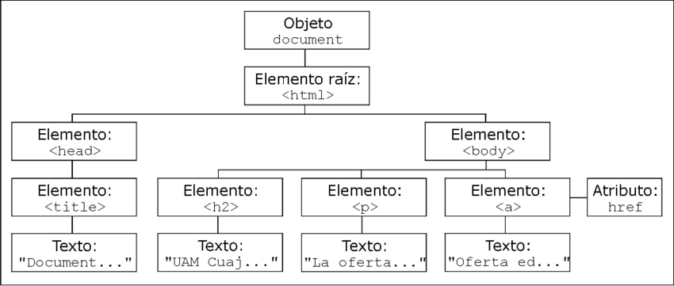
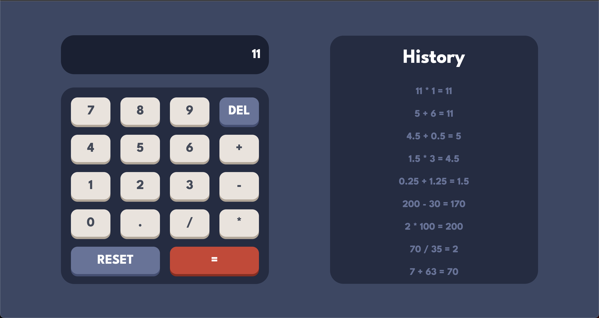
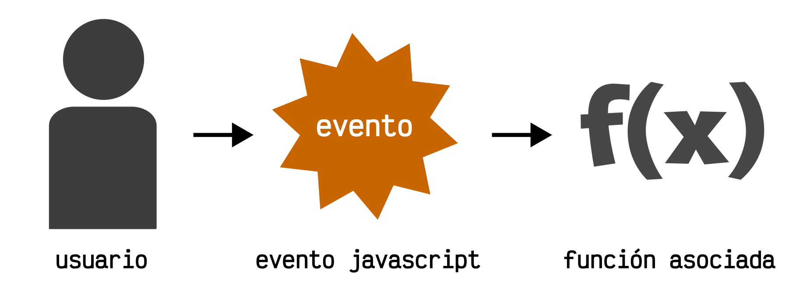
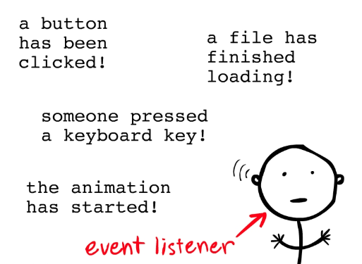
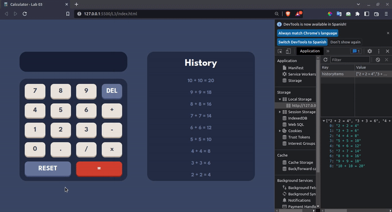
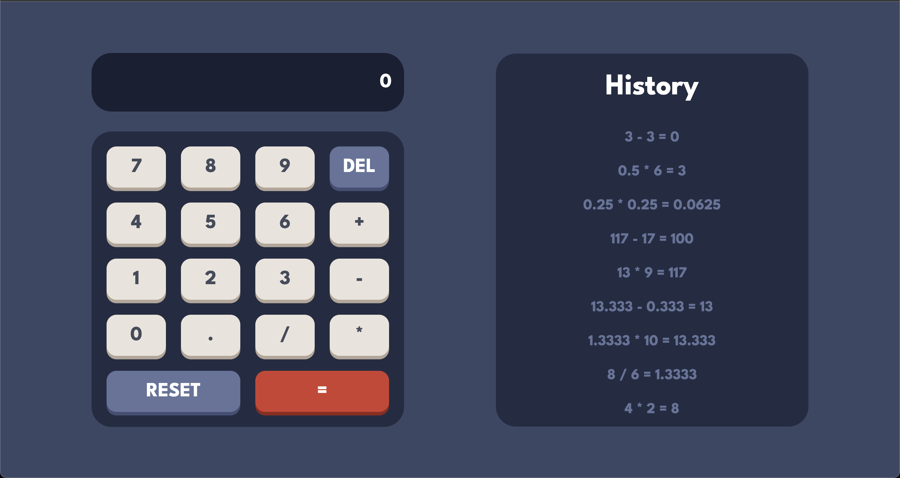

author:
summary: Laboratorio HTML, CSS & JS
id: laboratorio03
tags: summary
categories: Educación, Herramientas Digitales, Programación Web 2022
environments: Web
status: Published
feedback link: https://github.com/PW-UCA-Codes/PW-2022-Codelabs/issues

# Laboratorio 03 - HTML, CSS & JS

## ¿Qué es el DOM?

En Laboratorios previos se hizo uso tanto de `HTML` para crear la estructura de una página web, como de `CSS` para estilizar dicha página. No obstante al combinar ambas tecnologías solamente era posible crear sitios estáticos que carecen de funcionalidad. Para añadir dinamismo a un sitio web es necesario hacer uso de `JavaScript`.


Cuando una página web es renderizada, el navegador crea un **D**ocument **O**bject **M**odel (`DOM`) de la página. Es decir, un árbol de etiquetas relacionadas entre sí. Y por medio de `JavaScript` es posible añadir, modificar o eliminar etiquetas `HTML`. Asimismo, se pueden añadir clases y cambiar el contenido de dichas etiquetas.

El árbol `DOM` se ve alterado según la estructura de cada página web, en el siguiente ejemplo es posible observar como el nodo padre es llamado `document`, el cual tiene como hijo al nodo `&lt;html&gt;` que es llamado a su vez **elemento raíz**. Dicho nodo es padre del `head` y `body`, además dichos nodos cuentan con sus respectivos hijos.



## Primeros pasos

1. Clonar tu repositorio `portafolio` de GitHub
2. Descarga el comprimido que se encuentra en la sección `Laboratorios` dentro del `eCampus`. En dicho comprimido se encuentra tanto el `HTML` como el `CSS` del sitio web
3. Dentro de tu `portafolio` en el directorio `Laboratorios` crear una carpeta llamada `Laboratorio-03`. La cual tendrá la siguiente estructura:

```
├── assets
│   ├── css
│   │   └── style.css
│   ├── icons
│   │   └── icon.ico
│   └── js
│       └── main.js
└── index.html
```

4. Procede a aplicarle funcionalidad a tu sitio web haciendo uso de `JavaScript`

## Resultado esperado 

Al finalizar el laboratorio el resultado será una Calculadora capaz de realizar las operaciones básicas (`suma`, `resta`, `multiplicación` y `división`) entre dos números . Además, la Calculadora tendrá un historial de operaciones, donde se almacenarán las últimas 9. Dicho historial hará uso de `Local Storage` para tener permanencia de datos al recargar la página web.



## Seleccionando elementos del DOM

Una vez que se construye el árbol de nodos `DOM`, pueden emplearse funciones para poder acceder de forma directa a cualquier nodo del árbol. Al acceder a un nodo es posible manipularlo accediendo a su valor, cambiar un valor, moverlo en la jerarquía del árbol o crear nuevos elementos dentro de o a partir de él.

Para poder realizar dichas manipulaciones a los nodos del `DOM` es necesario obtenerlos a través de JavaScript.

JavaScript provee una serie de métodos para poder obtener nodos del `DOM`.
Primeramente se tienen los `métodos tradicionales` que son los siguientes:

<br>

| Método de búsqueda                 | Descripción                                                          |
| ---------------------------------- | -------------------------------------------------------------------- |
| .getElementById(**id**)            | Busca el elemento HTML mediante el **id**. Si no, devuelve **NULL**  |
| .getElementsByClassName(**class**) | Busca elementos mediante la **clase**. Si no, devuelve **[ ]**       |
| .getElementsByName(**attribute**)  | Busca elementos mediante el **atributo**. Si no, devuelve **[ ]**    |
| getElementsByTagName(**tag**)      | Busca elementos a través de su **tag** HTML. Si no, devuelve **[ ]** |

Aunque se pueden utilizar los métodos tradicionales vistos recientemente, actualmente se tiene a disposición dos nuevos métodos de búsqueda de elementos que son mucho más cómodos y prácticos si se conocen y dominan los `selectores CSS`.
Es el caso de los métodos `.querySelector()` y `.querySelectorAll()`:

<br>

| Método de búsqueda              | Descripción                                                                                       |
| ------------------------------- | ------------------------------------------------------------------------------------------------- |
| .querySelector(**selector**)    | Busca el primer elemento que coincide con el **selector CSS** indicado. Si no, devuelve **NULL**  |
| .querySelectorAll(**selector**) | Busca todos los elementos que coinciden con el **selector CSS** indicado. Si no, devuelve **[ ]** |

Con estos dos métodos se puede realizar todo lo que se hace con los métodos tradicionales mencionados anteriormente e incluso muchas más cosas (en menos código), ya que son muy flexibles y potentes gracias a los selectores CSS.

Para el caso de esta práctica de laboratorio se hará uso de los selectores `.querySelector()` y `.querySelectorAll()`, que para poder ser utilizados se hace a través del objeto `document`.

En primer lugar se deben obtener todos los números de la calculadora para poder identificar qué número es el que debe añadirse a la operación por realizar. Ya que se necesita obtener **todos** los números de la calculadora, se hace uso de `.querySelectorAll()` junto con el selector CSS `".number"` obteniendo así todos los elementos del DOM cuya clase sea `number`.
Al obtener un elemento del DOM debe almacenarse en una variable donde el tipo que suele utilizarse es `const`.

```js
const numbers = document.querySelectorAll(".number");
```

Posteriormente se obtienen los botones correspondientes a las operaciones matemáticas que puede realizar la calculadora, las cuales son **suma**. **resta**, **multiplicación** y **división**. Como se necesita un **único** elemento del DOM para cada operación se utiliza el método `.querySelector()` utilizando el `id` correspondiente a cada operación como selector CSS.

Se obtiene el botón para realizar la suma.

```js
const plus = document.querySelector("#plus");
```

Luego, se obtiene el botón para realizar la resta.

```js
const minus = document.querySelector("#minus");
```

Posteriormente, se obtiene el botón para realizar la multiplicación.

```js
const multiply = document.querySelector("#times");
```

Por último, se obtiene el botón para realizar la división.

```js
const divide = document.querySelector("#divide");
```

Ahora se deben obtener los botones que permiten realizar ciertas acciones que pueden realizarse en la calculadora.

Primero se obtiene el botón `del` el cual permite borrar un número u operador que esté escrito en la operación que se calculará.

```js
const del = document.querySelector(".delete-button");
```

El siguiente botón de acción que se obtiene es el de `reset` con el cual se borrará todo lo que se esté visualizando en la pantalla de la calculadora.

```js
const reset = document.querySelector(".reset-button");
```

El último botón que se obtiene es el botón de `igual`, con el cual se calculará la operación que está escrita en pantalla.

```js
const equal = document.querySelector(".equals-button");
```

Otro elemento muy importante del `DOM` que se debe obtener, es el texto de la pantalla de la calculadora, ya que es el elemento en el cual se verán las operaciones que se desean calcular, también donde se mostrarán los resultados obtenidos por cada operación e igualmente se mostrarán los errores que puedan ocurrir durante el cálculo de una operación matemática.

```js
const displayText = document.querySelector(".calculator-screen-text");
```

Para finalizar de obtener todos los elementos del `DOM`, se debe de obtener la lista para el historial de operaciones, en la cual se mostrarán los resultados de las últimas nueve operaciones calculadas.

```js
const historyList = document.querySelector(".history-list");
```

## Event Listener

Para conocer que es un `Event Listener` primero es necesario entender el concepto de un `Event`. Un evento permite notificar al navegador que alguna acción ha sido ejecutada por el usuario, entre los `event` más comunes se encuentran:

| **Event**   | **Description**                                        |
| ----------- | ------------------------------------------------------ |
| onchange    | Un elemento HTML ha sufrido algún cambio               |
| onclick     | El usuario ha hecho click sobre algún elemento HTML    |
| onmouseover | El usuario mueve el mouse sobre algún elemento HTML    |
| onmouseout  | El usuario mueve el mouse lejos de algún elemento HTML |
| onkeydown   | El usuario presiona alguna tecla                       |
| onload      | El navegador ha finalizado de cargar la página web     |

Luego de conocer algunos eventos, y saber que son accionados por el usuario. Cuando una acción sea ejecutada se debe manejar por medio de una función. Es ahí donde entra el concepto de `event listener`



JavaScript cuenta con un método que permite añadir funcionalidades a los eventos. Dicho método es `.addEventListener()`. Permite escuchar y estar a la espera de que alguno de los eventos previamente mencionados ocurra y si ocurre alguno se ejecuta una función asociada a dicho evento.

La sintaxis es la siguiente:

```js
.addEventListener(event, () => {

})
```



### Numbers Event Listener

El primer event listener que será definido será el de los números. Recordando que cada uno de los botones creados en el documento HTML que hacen referencia a los números del 0 al 9 cuentan con la clase `numbers` y que han sido obtenidos mediante `.querySelectorAll()`, dicho método devuelve una `NodeList` estática que representa una lista de los elementos que coinciden con un selector indicado. Para asignar un evento y una función a cada uno de ellos en necesario recorrer la lista donde han sido guardados dichos elementos.

```js
numbers.forEach((number) => {
  // Event Listener
});
```

La variable que estará iterando será `number`, entonces, a dicha variable se agregará el `eventListener`, que estará escuchando al evento `click` como primer argumento, y como segundo la función que se encargará de manejar dicha acción.

```js
number.addEventListener("click", () => {
  // Code
});
```

La primera validación a realizar será realizada haciendo uso de un `helper` que posteriormente será creado. Se verificará si existe algún error, y si es así el contenido de `displayText` tomará como valor una cadena de caracteres vacía. Caso contrario, si no hubo errores se concatenará al contenido de `displayText` el valor de `number`.

```js
if (checkError()) {
  displayText.innerHTML = "";
}
displayText.innerHTML += number.innerHTML;
```

Ahora ya que las operaciones dentro de la calculadora serán unicamente entre dos números, es necesario obtener dichos números. Para ello se utiliza el método [split](https://developer.mozilla.org/en-US/docs/Web/JavaScript/Reference/Global_Objects/String/split) junto con un expresión regular que separará los números que se encuentren entre un algún operador.

```js
const firstNumber = displayText.innerHTML.split(/[\+\-\*\/]/)[0];
const secondNumber = displayText.innerHTML.split(/[\+\-\*\/]/)[1];
```

Otra validación a realizar es verificar que tanto el primer número como el segundo no tengan más de nueve dígitos, y si dicho valor no es nulo se accede a la longitud para verificar si es mayor a 9. Si ocurre lo previamente mencionado, se eliminará el último valor añadido a la pantalla, el cuál sería el décimo dígito.

```js
if (firstNumber?.length > 9 || secondNumber?.length > 9) {
  displayText.innerHTML = displayText.innerHTML.slice(0, -1);
}
```

Seguidamente, es necesario validar que el primer número ingresado en caso de ser un número decimal no cuente con más de un punto. Para ello se crea una variable de tipo `const` donde se almacenará el arreglo que devuelve el método [match](https://developer.mozilla.org/en-US/docs/Web/JavaScript/Reference/Global_Objects/String/match). Dicho método por medio de una expresión regular verificará si en el primer número hay puntos.

```js
const dotsFirst = firstNumber.match(/\./g);
```

Ahora que ya se tienen almacenados en un arreglo la cantidad de puntos, por medio de un `if` se verifica si `dotsFirst` no está vacío y si su longitud es mayor a `1`. Si es así y el usuario intenta agregar otro punto decimal al primer número dicho punto se eliminará.

```js
if (dotsFirst && dotsFirst.length > 1) {
  displayText.innerHTML = displayText.innerHTML.slice(0, -1);
}
```

Seguidamente, será necesario verificar si se ha introducido un segundo número. Para ello, se hará uso de un `if` y dentro de el se creará una variable de tipo `const` la cuál se encargará de almacenar el arreglo que retorne el método `match` que verificará si dentro de el segundo número existen puntos. Además, se hará uso de otro condicional el cual tendrá la función de revisar si `dotsSecond` no está vacío y si su longitud es mayor a `1`. Si eso ocurre y el usuario intenta agregar otro punto al segundo número, dicho punto será eliminado.

```js
if (secondNumber) {
  const dotsSecond = secondNumber.match(/\./g);

  if (dotsSecond && dotsSecond.length > 1) {
    displayText.innerHTML = displayText.innerHTML.slice(0, -1);
  }
}
```

El `eventListener` para los números ha sido finalizado.

### Operators Event Listener

Ahora, para trabajar con los operadores será más cómodo agruparlos a todos dentro de un `JSON`.

```js
const operators = {
  plus,
  minus,
  multiply,
  divide,
};
```

Con los operadores agrupados en un `JSON` se procede a recorrer dicho `JSON` haciendo uso de un `for`. Dicho bucle iterará las variable de tipo `const` llamada `operator` dentro del arreglo de objetos llamado `operators`

```js
for (const operator in operators) {
  // Event listener
}
```

Seguidamente, dentro del bucle previamente creado se accederá al arreglo de objetos `operators` en la posición en la que se encuentre la variable `operator`, para posteriormente hacer uso del método `.addEventListener()`, que recibirá como primer argumento el evento `click` y como segundo argumento la función que se ejecutará cuando dicho evento sea accionado.

```js
operators[operator].addEventListener("click", () => {
  // Code
});
```

Además, se debe verificar que no haya un error en pantalla, esto se realizar negando el `helper` llamado `checkError()` que posteriormente será creado. Asimismo, se verifica que el contenido de la variable `displayText` no esté vacío, dado que no es posible agregar un operador antes que un número. Si es así se concatenará al contenido de `displayText` el operador que haya sido presionado dentro de la calculadora.

```js
if (!checkError() && displayText.innerHTML !== "") {
  displayText.innerHTML += operators[operator].innerHTML;
}
```

Con los operadores es necesario validar la cantidad de operadores que hay en pantalla. Entonces, se hace uso del método `match` que se encargará de verificar si dentro del contenido de `displayText` existe algún operador por medio de una `regex`. Para posteriormente almacenar el arreglo que retorna dicho método en la variable `operatorsInDisplay`.

```js
const operatorsInDisplay = displayText.innerHTML.match(/[\+\-\*\/]/g);
```

Ahora se hace uso de un condicional para verificar que el arreglo `operatorsInDisplay` no esté vacío y verificar si su longitud es mayor a `1`. Dado que si esto ocurre y el usuario intenta agregar otro operador a la operación será eliminado haciendo uso del método `slice`.

```js
if (operatorsInDisplay && operatorsInDisplay.length > 1) {
  displayText.innerHTML = displayText.innerHTML.slice(
    0,
    displayText.innerHTML.length - 1
  );
}
```

El `eventListener` para los operadores ha sido finalizado.

### Misc Event Listener

Finalmente, al resto de botones de la calculador se les debe asociar un `eventListener` para cuando sean presionados.

En el caso del botón `del` cuando sea presionado se verificará que no hayan errores en pantalla, para posteriormente en el contenido de `displayText` eliminar el último dígito o valor agregado.

```js
del.addEventListener("click", () => {
  if (!checkError()) {
    displayText.innerHTML = displayText.innerHTML.slice(0, -1);
  }
});
```

El siguiente botón es `reset`, cuando sea presionado el contenido de `displayText` será cambiado por una cadena vacía.

```js
reset.addEventListener("click", () => {
  displayText.innerHTML = "";
});
```

Finalmente, cuando el botón `equal` sea presionado se mandará a llamar a la función `operateAndShow`. Dicha función será creada posteriormente en la sección `helpers`.

```js
equal.addEventListener("click", () => {
  operateAndShow();
});
```

## Helpers

Un helper es una forma de agrupar funciones de uso común, destinadas a servir de ayuda a otros procesos. Un Helper se compone de funciones genéricas que se encargan de realizar acciones complementarias, aplicables a cualquier elemento de un sistema.

El primer helper es el encargado de calcular el resultado de la operación deseada. Para ello se define una función llamada `calculate` que recibe tres parámetros: `a` que es el primer operando, `b` que corresponde al segundo operando y por último el `operator`.

```js
const calculate = (a, b, operator) => {
  // Switch
};
```

Dentro de la función se validará cuál es la operación que se desea realizar según el operador que se envía como parámetro, para ello se hará uso de `switch`.

```js
switch (operator) {
  // Cases
}
```

Dentro del switch se tendrá cada uno de los casos, para el primero si el operador que se envía es `+` entonces se retorna el valor de `a + b`.

```js
case "+":
  return a + b;
```

El segundo caso es si el operador que se envía es `-` entonces se retorna el valor de `a - b`.

```js
case "-":
  return a - b;
```

El tercer caso es si el operador que se envía es `x` entonces se retorna el valor de `a * b`.

```js
case "*":
  return a * b;
```

El último caso es si el operador que se envía es `/` entonces se retorna el valor de `a / b`.

```js
case "/":
  return a / b;
```

El siguiente helper a utilizar es el encargado de validar si hay algún mensaje de error en la pantalla de la calculadora.
Para ello se define una función llamada `checkError` la cual no recibirá ningún parámetro.

```js
const checkError = () => {
  // If code
};
```

Dentro de la función se debe validar si la pantalla está mostrando algún mensaje de error, ya sea `Error`, `Infinity`, `undefined` o `NaN`.

```js
if (
    displayText.innerHTML === "Error" ||
    displayText.innerHTML === "Infinity" ||
    displayText.innerHTML === "undefined" ||
    displayText.innerHTML === "NaN"
  )
```

Por lo que si en efecto se está mostrando alguno de los mensajes de error en pantalla, se retornará `true`.

```js
{
  return true;
}
```

El último helper a utilizar es el encargado de operar los números y ejecutar la renderización dinámica de los elementos del historial. Para ello se define una función llamada `operateAndShow` que no recibe parámetros.

```js
const operateAndShow = () => {
  // Try catch
};
```

Dentro de la función se hará el manejo de los errores utilizando el bloque `try-catch`.

```js
try {
  // try code
} catch (e) {
  // catch code
}
```

Luego, dentro del bloque `try` se definirán las instrucciones a realizar mientras no se arrojen excepciones que rompan con el flujo de la función.

En primer lugar se debe obtener el valor del `primer número` de la operación, el `operador` a utilizar y el valor del `segundo número`.

Para obtener el primer y segundo número se accede al contenido HTML dentro de variable `displayText` la cual contiene un `string` que representa la operación en pantalla. Para poder separar el primer y segundo número del `string` se hará uso del método [split](https://developer.mozilla.org/en-US/docs/Web/JavaScript/Reference/Global_Objects/String/split) el cuál permite separar una cadena de caracteres en sub cadenas a partir de un separador. Se usa la sintaxis `<string>.split(<separador>)` y el retorno es un arreglo que contiene las sub cadenas.

Se obtiene el primer número utilizando como argumento del método `split` la expresión regular `/[\+\-\x\/]/`, por lo cual se separan en sub cadenas cuando se encuentre un operador `+`, `-`, `x` ó `/`. Como el método `split` retorna un arreglo con las sub cadenas, se accede a la posición `0` para obtener el número deseado.

```js
const firstNumber = displayText.innerHTML.split(/[\+\-\*\/]/)[0];
```

Se realiza el mismo proceso para obtener el segundo número, pero esta vez se accede a la posición `1` del arreglo retornado por el método `split`.

```js
const secondNumber = displayText.innerHTML.split(/[\+\-\*\/]/)[1];
```

Para obtener el operador se accede al contenido HTML dentro de variable `displayText` y se hace uso del método [match](https://developer.mozilla.org/en-US/docs/Web/JavaScript/Reference/Global_Objects/String/match) el cual se usa para obtener todas las ocurrencias de una expresión regular dentro de una cadena y las retorna en un arreglo. Ya que la calculadora solo opera con dos números solo existirá un único operador, por lo cual si se accede a la posición `0` se obtiene el operador deseado. La expresión regular a utilizar será igualmente `/[\+\-\x\/]/`.

```js
const operator = displayText.innerHTML.match(/[\+\-\*\/]/)[0];
```

Ya que se tienen todos los elementos de la operación, es posible calcular el resultado. Para ello se hará uso del helper creado anteriormente llamado `calculate`, se enviará como argumento el `primer número`, el `segundo número` y el `operador`. Es necesario hacer una conversión de los dos números a tipo `float` ya que actualmente se tienen como tipo `string` y para ello se hace uso de la función `parseFloat`.

```js
const result = calculate(
  parseFloat(firstNumber),
  parseFloat(secondNumber),
  operator
);
```

Luego de calcular el resultado se debe de redondear a cuatro decimales para que se muestren correctamente en pantalla, para ello se hace uso de la función `round` del objeto `Math`.

```js
const roundedResult = Math.round(result * 10000) / 10000;
```

Para finalizar el cálculo de la función y mostrar el resultado en pantalla, se debe verificar que no existan errores en pantalla actualmente, para ello se hace uso del helper `checkError`.

```js
if (!checkError()) {
  // Code
}
```

Si no hay errores en pantalla, se cambiará el contenido HTML dentro de variable `displayText` por el resultado redondeado a cuatro decimales.

```js
displayText.innerHTML = roundedResult;
```

En caso de ocurrir alguna excepción, el programa entrará en el bloque `catch`, donde será necesario limpiar la pantalla de la calculadora.

```js
displayText.innerHTML = "";
```

## Renderizado dinámico

En JavaScript es posible añadir elementos al `DOM` de acuerdo a la ejecución de una acción. Cuando un elemento se añade al HTML según las acciones del usuario se le conoce como `Renderizado Dinámico`. En este caso se necesita renderizar un nuevo elemento cada vez que el usuario realizar una operación en la calculadora para ser almacenada en el historial.

Se procede a crear una `arrow function` llamada `renderHistoryItem`, la cual necesita recibir como argumento el `item` a renderizar.

```js
const renderHistoryItem = (item) => {
  // Code
};
```

Seguidamente, se crea una variable de tipo `const` llamada `historyItem` la cual contendrá el elemento `li` creado mediante el método `.createElement()`. Además, a dicho elemento creado se le añadirá la clase `history-item` lo que permitirá que sea estilizado mediante `CSS`. Finalmente, el contenido del `li` (list item) será el que haya sido enviado como argumento a la función.

```js
const historyItem = document.createElement("li");
historyItem.classList.add("history-item");
historyItem.innerHTML = item;
```

Posteriormente es necesario verificar si hay algún error en `displayText`, ya que si existe alguno, no se debe renderizar en el historial. Para ello se utiliza un condicional `if` y se niega la función creada en `helpers` llamada `checkError()`, dado que si no existe algún error al elemento `ul` del `HTML` que fue almacenado en la variable `historyList` se le añadirá al inicio el `li` creado previamente, el cual se llama `historyItem`.

```js
if (!checkError()) {
  historyList.prepend(historyItem);
}
```

Seguidamente, se debe verificar que la longitud de los hijos de `historyList` no sea mayor a `9`. Si es mayor a `9` se procede a eliminar el último hijo añadido.

```js
if (historyList.children.length > 9) {
  historyList.removeChild(historyList.lastChild);
}
```

Ahora que la función para renderizar los items del historial ha sido creada, es necesario llamarla en la función `operateAndShow()` que fue creada en la sección `helpers`. Luego de que se agrega al contenido de `displayText` el resultado redondeado.

```js
if (!checkError()) {
  displayText.innerHTML = roundedResult;
  // History item and render code must be added bellow
}
```

Se debe crear una variable de tipo `const` llamada `historyItem` la cual será un `template string` que concatenará el `firstNumber` seguido del `operator`, junto con el `secondNumber`, seguido del signo `=` y finalmente el `roundedResult`.

```js
const historyItem = `${firstNumber} ${operator} ${secondNumber} = ${roundedResult}`;
```

Ya que se obtiene la información de toda la operación realizada se procede a llamar a la función `renderHistoryItem` enviándole el `historyItem`. Dicha función se encargará de renderizar dicha operación en el historial.

```js
renderHistoryItem(historyItem);
```

## Local Storage

Como es posible observar, el historial de operaciones no posee `persistencia de datos`, ya que al recargar la página en el navegador, todas las operaciones que se calcularon anteriormente son eliminadas del historial.

El navegador por si mismo no es capaz de mantener los cambios que se realizan al DOM de manera dinámica con JavaScript, por lo que es necesario auxiliarse de otras estrategias para poder lograr la permanencia de los datos. Una de las más comunes es el uso del `localStorage`.

localStorage es un objeto de almacenaje web que permiten guardar pares de `clave/valor` en el navegador.
Las claves y los valores son siempre cadenas de texto (ten en cuenta que, al igual que con los objetos, las claves de enteros se convertirán automáticamente en cadenas de texto).

El `localStorage` provee los siguientes métodos y propiedades para trabajar en él:

| Método / Propiedad            | Descripción                            |
| ----------------------------- | -------------------------------------- |
| setItem(**clave**, **valor**) | almacenar un par clave/valor           |
| getItem(**clave**)            | obtener el valor por medio de la clave |
| removeItem(**clave**)         | eliminar la clave y su valor           |
| clear()                       | borrar todo del localStorage           |
| key(**índice**)               | obtener la clave de una posición dada  |
| length                        | el número de ítems almacenados         |

Primero se creará la función encargada de obtener los elementos que se tengan guardados en el `localStorage`, para ello se crea una función llamada `getHistoryItemsFromLocalStorage`.

```js
const getHistoryItemsFromLocalStorage = () => {
  // Code
};
```

Para obtener un elemento del localStorage se hace uso del método `getItem` el cuál recibe como argumento la clave del objeto que se desea obtener, en este caso se estarán guardando los items del historial como un arreglo cuya clave sea `historyItems`.

Debido a que el `localStorage` solo almacena strings se debe convertir el retorno del método getItem por objetos de JavaScript que se puedan manipular, para ello se utiliza el método `parse` del objeto `JSON`.

Por último, ya que el método getItem retorna `null` si la clave enviada no corresponde a un elemento almacenado en el localStorage, es necesario darle un valor por defecto, para ello se usa las `short-circuit evaluations` de modo que si `getItem("historyItem")` es `null`, el valor por defecto que se guardará es `[ ]`.

```js
const historyItems = JSON.parse(localStorage.getItem("historyItems")) || [];
```

Una vez se obtienen los elementos del localStorage se retornan en la función.

```js
return historyItems;
```

Ahora para poder almacenar los elementos del historial al `localStorage` se creará una función llamada `addHistoryItemToLocalStorage` que recibirá como parámetro el `item` que se agregará al localStorage.

```js
const addHistoryItemToLocalStorage = (item) => {
  // Code
};
```

Dentro de la función es necesario validar que no existan errores en pantalla ya que sino se estarían almacenando los errores en el localStorage. Para ello se utiliza el helper `checkError()`.

```js
if (!checkError()) {
  // Code
}
```

Primeramente, si no hay errores, se obtendrán los elementos que hay guardados actualmente en el localStorage utilizando la función creada anteriormente.

```js
const historyItems = getHistoryItemsFromLocalStorage();
```

Luego se agrega el nuevo `item` que fue enviando a la función, al arreglo que tiene los elementos guardados obtenidos del localStorage.

```js
historyItems.push(item);
```

Ya que el historial solo muestra las últimas nueve operaciones realizadas, es necesario verificar si luego de agregar el nuevo `item` hay más de nueve operaciones en el arreglo. Si esta condición se cumple se elimina el primer elemento del arreglo, ya que el primer elemento es la operación más antigua realizada.

```js
if (historyItems.length > 9) {
  historyItems.shift();
}
```

Luego de realizar la validación se guardan los items del historial actualizados en el localStorage utilizando el método `setItem`, enviándole como argumento la clave que se está utilizando `historyItems` y el valor que se enviará, en este caso el arreglo con el mismo nombre pero convertido a `String` utilizando el método `stringify` del objeto `JSON`.

```js
localStorage.setItem("historyItems", JSON.stringify(historyItems));
```

Ya que se ha definido la función para añadir elementos al localStorage, se debe ejecutar dicha función cada vez que se realice una operación, para ello en el helper `operateAndShow()`, dentro del bloque `try` y dentro de la validación que no hayan mensajes de error en pantalla, se debe de ejecutar la función `addHistoryItemToLocalStorage()` enviándole como argumento el item a agregar.

```js
const operateAndShow = () => {
  try {
    // Code

    if (!checkError()) {
      // Code

      // This function must be added
      addHistoryItemToLocalStorage(historyItem);
    }
  } catch (e) {
    // Code
  }
};
```

Para finalizar con la funcionalidad e implementación del localStorage, se debe añadir un `Event Listener` que permita renderizar el historial de operaciones a partir de los elementos almacenados en el `localStorage`. El evento al que se le añadirá el listener es al evento `DOMContentLoaded` que se acciona cuando el navegador HTML está completamente cargado y el árbol DOM está construido.

```js
document.addEventListener("DOMContentLoaded", () => {
  // Code
});
```

Dentro del eventListener primero se obtienen los elementos del localStorage que se van a renderizar, se hace uso de la función `getHistoryItemsFromLocalStorage()`. La cual fue previamente creada.

```js
const historyItems = getHistoryItemsFromLocalStorage();
```

Por último, cada elemento del historial se enviará como argumento a la función `renderHistoryItem` la cual se encargará de renderizar cada uno de los elementos.

```js
historyItems.forEach((item) => renderHistoryItem(item));
```

De esta forma se ha logrado la permanencia de los datos, por lo que si se recarga el navegador se deben de mantener las operaciones en el historial.



## Resultado final

Al terminar de programar la parte funcional por medio de `JavaScript` tu sitio web debería verse de la siguiente manera:



<aside class="positive">
  <p>
    No olvides hacer push de tus avances a tu repositorio de GitHub al finalizar el laboratorio.
  </p>
</aside>
