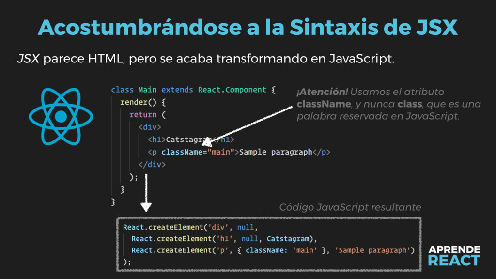
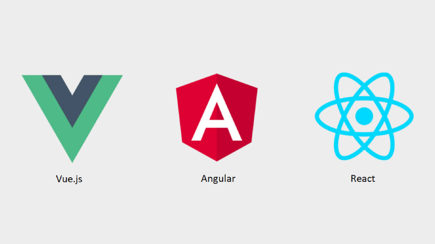
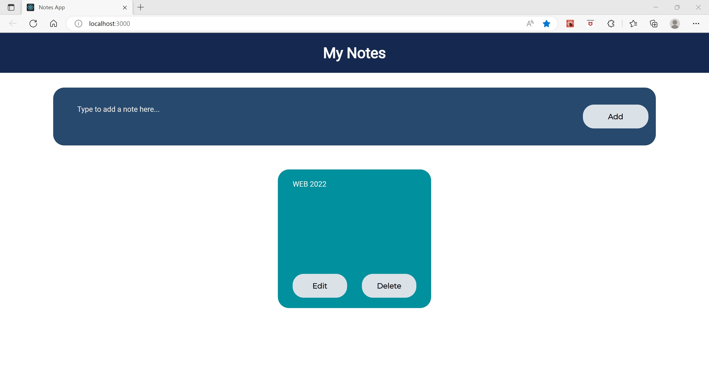
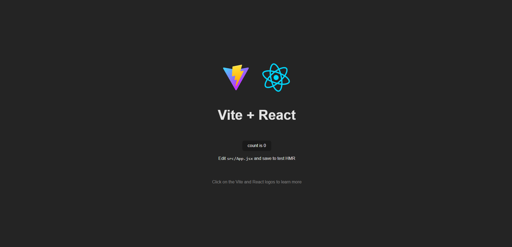
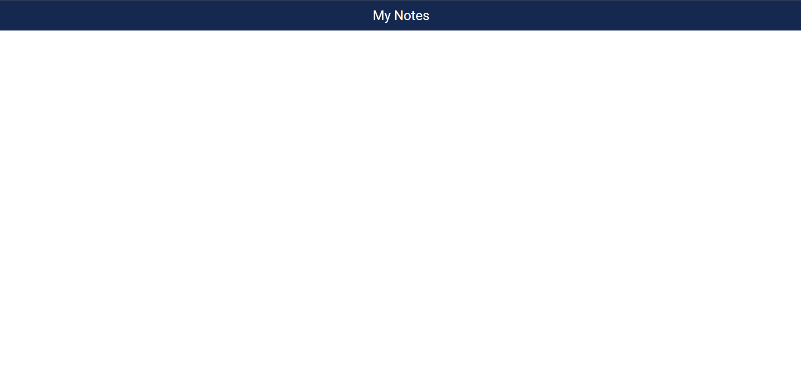
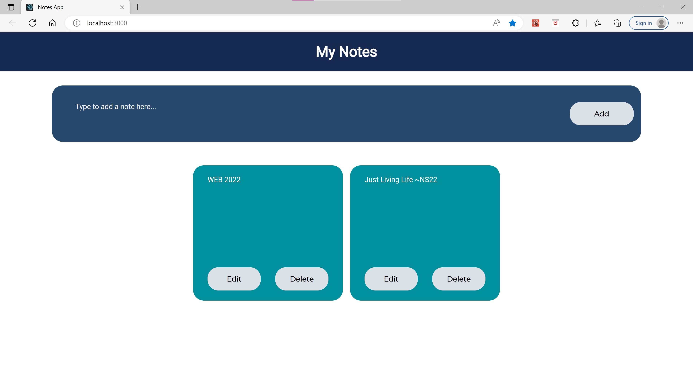

author: Natalia Solórzano, Bryan Flores, Leonardo Albiñana, Kevin Escobar, Erika Quinteros
summary: Laboratorio React
id: laboratorio04
tags: summary
categories: Educación, Herramientas Digitales, Programación WEB 2022
environments: Web
status: Published
feedback link: https://github.com/PW-UCA-Codes/PW-2022-Codelabs/issues

# Laboratorio 04 - React JS

## ¿Qué es React?
React.js es el marco de JavaScript de front-end más conocido, es una librería para construir interfaces de usuario.

Se basa en una arquitectura de componentes, que pueden contener propiedades individuales, así como su propio estado, con lo cual se pueden reutilizar en diferentes partes de la misma interfaz, o incluso en interfaces diferentes.

React se puede renderizar en el navegador con la ayuda de otra librería llamada ReactDOM, así como también del el lado del servidor a través de Nodejs.

Además también sirve para crear aplicaciones móviles a través del framework React Native.

React fue concebido en el año 2011 dentro del equipo de desarrollo de Facebook, y abierto a la comunidad en Mayo de 2013. Hoy en día es mantenido aún por la red social, además de una amplia comunidad de desarrolladores.


## ¿Qué es JSX?
JSX es un lenguaje con sintaxis basada en XML (igual que HTML) creada también por el equipo de Facebook, que extiende JavaScript y simplifica la experiencia de desarrollo.

JSX permite crear elementos de DOM con una sintaxis como la de HTML, dentro de JavaScript.

JSX no esta creado para ser funcional exclusivamente a React, ni tampoco es obligatorio usarlo al desarrollar con esta librería. Sin embargo, en el contexto de React, JSX provee una sintaxis amigable para el método **React.createElement**.

Veamos un ejemplo:

```
const Titulo = function () {
  return (
    <h1>
      Bienvenido a <strong>JSX</strong>
    </h1>
  )
}
```
Al ser compilado, este fragmento de código producirá un resultado similar al siguiente:

```
const Titulo = function () {
  return React.createElement("h1", null, "Bienvenido a ",
  React.createElement("strong", null, "JSX")
  )
}
```


## Por qué elegir React vs. otros frameworks
Existen múltiples criterios posibles para elegir una librería por sobre otra. En términos generales, **React** es la más popular de las librerías de desarrollo de front-end.

Esto implica que posee una comunidad grande de desarrolladores dedicados a mantenerla, una vasta cantidad de recursos online para aprender a usarla, un sinfín de componentes y módulos que la complementan, y además una amplia demanda en el mercado profesional.

En términos subjetivos, a algunos desarrolladores podrá resultarle mas amigable la sintaxis de React y su experiencia de desarrollo que a otros.



## Resultado esperado

Al finalizar el laboratorio el resultado será una aplicación de notas capaz de realizar un CRUD (**CREATE, READ, UPDATE, DELETE**). Al mismo tiempo la información se almacenará en `local Storage`, permitiendo la permanencia de datos.



## Primeros pasos

1. Clonar tu repositorio `portafolio` de GitHub
2. Dentro de tu `portafolio` en el directorio `Laboratorios` ejecuta el siguiente comando: `yarn create vite`. Vite es una herramienta que permite crear proyectos en multiples frameworks de una manera más rápida y sencilla.

Primeramente, se debe escoger el nombre del proyecto. En este caso será `laboratorio-04`. Seguidamente el framework a utilizar. Selecciona `React.` Y finalmente, se solicita la variante de lenguaje a utilizar, escoge `JavaScript`.

```
yarn create v1.22.19
[1/4] Resolving packages...
[2/4] Fetching packages...
[3/4] Linking dependencies...
[4/4] Building fresh packages...

success Installed "create-vite@3.2.0" with binaries:
      - create-vite
      - cva
 Project name: › laboratorio-04
 Select a framework: > React
 Select a variant: > JavaScript
```

3. Ahora es necesario acceder al directorio que fue creado por medio de `Vite`. Para ello es necesario ejecutar `cd laboratorio-04`,

4. Una vez dentro del directorio es necesario instalar toda la paquetería para que el proyecto funcione. Ejecuta `yarn`.

5. Ya que la paquetería está instalada. Procede a levantar el proyecto de `React` creado por medio de `Vite`. Ejecuta `yarn dev`.

6. En consola se mostrará en que puerto del `localhost` está corriendo el proyecto. Accede a él y deberías ver la siguiente pantalla.



## Limpiando el entorno

Dentro del proyecto que previamente se creo, se debe expandir el directorio `src`. Ya que dentro de el se estará trabajando la pagina web. Dicho directorio debería de verse de la siguiente manera:

```
src
├── App.css
├── App.jsx
├── assets
│   └── react.svg
├── index.css
└── main.jsx
```

Ahora, es necesario abrir el archivo `App.jsx` y limpiar todo el contenido que se encuentre dentro de la clase `App`. Cabe recalcar que dicho componente es el contenedor principal de toda la página web.

```jsx
import "./App.css";

function App() {
  return <div className="App"></div>;
}

export default App;
```

Seguidamente, el contenido del archivo `App.css` es posible borrarlo todo ya que no será utilizado.

Para indicar que fuentes serán utilizadas se hará uso de `Google Fonts` y se añadirán al archivo `index.html` dentro de la etiqueta `head`.

```
<link rel="preconnect" href="https://fonts.googleapis.com" />
<link rel="preconnect" href="https://fonts.gstatic.com" crossorigin />
<link href="https://fonts.googleapis.com/css2?family=Montserratfamily=Roboto&display=swap" rel="stylesheet"/>
```

Además, se cambiará el contenido de la etiqueta `title` a `Notes App`.

Asimismo, dentro del archivo llamado `index.css`, se cambiará la fuente que trae por defecto a `Montserrat`.

```css
font-family: "Montserrat", sans-serif;
```

El color de fondo de la página web será cambiado a blanco.

```css
background-color: #ffffff;
```

Y finalmente se seleccionará a todo el cuerpo de la página para aplicarle un `margin: 0`

```css
body {
  margin: 0;
}
```

## Componente Header

Habiendo limpiado previamente el proyecto es posible comenzar con la creación de los componentes a utilizar. Primeramente se debe crear un directorio llamado `Components` dentro del directorio `src`. Dicho directorio se encargará de contener todos los componentes que posteriormente serán creados para dar funcionalidad a página web.

El primer componente a crear va a ser el componente `Header`. Para ello se procede a crear un directorio llamado `Header`. Que contendrá un archivo `.jsx` y `.css` con el mismo nombre.

```
├── Header
    ├── Header.css
    └──  Header.jsx
```

Ahora, se procede con la creación de dicho componente. Primeramente al estar haciendo uso de la extensión `.jsx`en los archivos se debe realizar la siguiente importación.

```jsx
import React from "react";
```

Posteriormente, se crea el componente funcional haciendo uso de una función de flecha

```jsx
const Header = () => {

};
```

Y dicho componente debe ser exportado para ser utilizado dentro de otros componentes.

```jsx
export default Header;
```

Cabe recalcar que cada componente que sea creado dentro de `React` debe cumplir con la cualidad de retornar unicamente un elemento padre.

Dentro del componente funcional previamente creado se procede a indicar la información a retornar. El elemento padre será una etiqueta `header` que cuenta con la clase `header` y que tendrá como hijo un encabezado `h1` que tendrá como contenido `My Notes`.

```jsx
return (
  <header className="header">
    <h1>My Notes</h1>
  </header>
);
```

Para poder estilizar dicho componente se debe importar el módulo `css` a utilizar para el `Header`.

```jsx
import "./Header.css";
```

Y dentro de dicho módulo se definen los estilos. Para el contenedor unicamente se le aplica un color de fondo y un margin cero para que este centrado.

```css
.header {
  background-color: #142850;
  margin: 0;
}
```

Y al encabezado `h1` que es hijo directo del elemento con la clase `header` se le define el tipo de fuente a utilizar, junto con el tamaño, peso de fuente y color de fuente. Además, se indica que dicho texto estará alineado hacia el centro, que contará con un margin 0 y un padding de 1.5rem.

```css
.header > h1 {
  font-family: "Roboto", sans-serif;
  font-size: 2rem;
  font-weight: 700;
  color: white;
  text-align: center;
  margin: 0;
  padding: 1.5rem;
}
```

Con dicho elemento creado, se procede a importarlo dentro del archivo `App.jsx` para que pueda ser visualizado.

```jsx
import Header from "./Components/Header/Header";
```

Y se añade dentro de la etiqueta `div` de la siguiente manera:

```jsx
<div className="App">
  <Header />
</div>
```

Al finalizar dicha sección en el navegador será posible ver el componente `Header`.



## Componente Container

Dentro del directorio `Components` es necesario crear uno nuevo llamado `Container`. El cual se encargará de almacenar un formulario y unas cards que posteriormente serán creadas para agregar funcionalidad a la página web.

Además, dentro del directorio `Components` crea un archivo `Container.jsx` y otro llamado `Container.css`. La estructura del directorio debería verse de la siguiente manera:

```
Components
├── Container
│   ├── Container.css
│   └── Container.jsx
└── Header
    ├── Header.css
    └── Header.jsx
```

El archivo `Container.css` indicará que la clase `.container` tendrá un ancho y una altura del 100%, será un `flex-box` con orientación en columna y que estará centrada.

```css
.container {
  width: 100%;
  height: 100%;
  display: flex;
  flex-direction: column;
  align-items: center;
}
```

Ahora, se procede a añadir la funcionalidad al contenedor. Para ello, en el archivo `Container.jsx`. Se importa `React`. Además, se hace una destructurización a los `Hooks` llamados `useState` y `useEffect` provenientes de `react`. Seguidamente se importa el módulo de estilos correspondiente al componente `Container`.

```jsx
import React, { useState, useEffect } from "react";
import "./Container.css";
```

Seguidamente se crea el componente funcional haciendo uso de las funciones anónimas.

```jsx
const Container = () => {
  // Code
};
```

Y se exporta el contenedor para que pueda ser utilizado en otros módulos.

```jsx
export default Container;
```

### Inicializando el hook useState

useState permite mantener un rastreo de lo que le ocurre a un componente de React y devuelve dos valores, uno que corresponde al estado actual y otro que corresponde a una función que actualiza el estado.

Ya que previamente se realizó la importación de dicho Hook. Se deben inicializar para cada uno de los usos que se le dará dentro del componente container.

1. El primer uso de useState es utilizado para rastrear cuando una nota es creada y actualizar dicho componente cuando dicha nota sea agregada al localStorage, dicho Hook es inicializado con una cadena vacía.

2. La segunda inicialización del Hook es utilizada para obtener todas las notas que hayan sido creadas y renderizar un nuevo componente al momento que se detecte una nueva, dicho Hook es inicializado con un arreglo vacío.

3. Y la última inicialización de useState es para rastrear cuando una alerta debe ser mostrada y actualizar dicho estado cuando se este mostrando, dicho hook será tratado como un valor boolean y será inicializado con `false`

```jsx
const [note, setNote] = useState("");
const [notes, setNotes] = useState([]);
const [showAlert, setShowAlert] = useState(false);
```

### Agregar notas

Para poder crear una nota se crea una función llamada `addNote` la cual recibirá como argumento `note`, que corresponde al estado actual de una nota. Dicha función tendrá toda la lógica detrás del proceso de agregar una nueva nota.

```jsx
const addNote = (note) => {
  // Code
};
```

Antes de realizar cualquier proceso se verifica si la longitud de la nota es menor a la unidad. Lo que indicaría que es una nota vacía.

```jsx
if (note.length < 1) {
  // Code
}
```

Seguidamente, se verifica siempre dentro del if anterior, si el estado de `showAlert` se encuentra en verdadero. Ya que si esto ocurre, indica que la alerta está siendo mostrada, por ende no se mostrará de nuevo.

```jsx
if (showAlert) {
  return;
}
```

Si el if anterior no ocurre indica que la alerta no está siendo mostrada. Lo que permite actualizar el estado de `showAlert` a verdadero. Esto se realiza haciendo uso de la función `setShowAlert`.

```jsx
setShowAlert(true);
```

No obstante, la alerta debe ser ocultada luego de 4 segundos. Para hacer esto posible se utiliza `setTimeout`. Que se encargará de cambiar el estado de `showAlert` a falso luego de que los 4 segundos hayan ocurrido.

```jsx
setTimeout(() => {
  setShowAlert(false);
}, 4000);
return;
```

Seguidamente, se declara una variable de tipo `const` que contendrá la información que se encuentre en el `localStorage` que haga uso de la key `notes`. Si no se encuentra nada la variable tendrá un arreglo vació.

```jsx
const notes = JSON.parse(localStorage.getItem("notes")) || [];
```

Se crea un objeto llamado `noteObj` que tendrá como propiedades el `id` y la `note` a almacenar. El `id` será asignado haciendo uso del método `Date.now()`.

```jsx
const noteObj = {
  id: Date.now(),
  note,
};
```

Ahora al arreglo que fue obtenido del `localStorage` y almacenado en la variable `notes` se le agrega el nuevo `nodeObj` haciendo uso del método `push`. Además, se actualiza la información del `localStorage` por medio del `setItem` donde se le envía la `key` con la que se almacenará la información y el `value` que debe ser convertido a un `JSON`.

```jsx
notes.push(noteObj);
localStorage.setItem("notes", JSON.stringify(notes));
```

Y finalmente se actualiza la `note` con la función `setNote` enviándole el nuevo estado de la nota.

```jsx
setNotes(notes);
```

### Eliminar una nota

Ahora para el proceso de eliminación de una nota, es necesario crear una función llamada `deleteNote`, dicha función recibirá el `id` de la nota a eliminar.

```jsx
const deleteNote = (id) => {
  // Code
};
```

Primeramente se debe obtener el la información almacenada en el `localStorage`. Además, se crea una nueva variable de tipo `const` que se encargará de filtrar la información obtenida previamente, y obtener un nuevo arreglo donde la nota con el `id` enviado no se encuentre.

```jsx
const notes = JSON.parse(localStorage.getItem("notes")) || [];
const newNotes = notes.filter((note) => note.id !== id);
```

Seguidamente, al `localStorage` se le brinda el nuevo arreglo que no cuenta con la nota a eliminar haciendo uso de `setItem`, con la `key` llamada `notes` y el `value` que será el arreglo llamado `newNotes`.

```jsx
localStorage.setItem("notes", JSON.stringify(newNotes));
```

Y finalmente se actualiza el estado del arreglo `notes` haciendo uso de la función `setNotes` retornando un arreglo donde en elemento a eliminar ya no se encuentre.

```jsx
setNotes((prevNotes) => {
  return prevNotes.filter((note) => note.id !== id);
});
```

### Editar una nota

Para poder editar una nota se debe crear una función llamada `editNote` la cual debe recibir el `id` de la nota a editar y la nueva `note` a almacenar.

```jsx
const editNote = (id, note) => {
  // Code
};
```

Además, se almacena la información que se encuentra en el `localStorage` en una variable de tipo `const`. También, para poder realizar el proceso de actualización se necesita conocer la posición en la que se encuentra la nota a actualizar. Esto es posible realizarlo haciendo uso del método `findIndex`.

```jsx
const notes = JSON.parse(localStorage.getItem("notes") || []);
const noteIndex = notes.findIndex((note) => note.id === id);
```

Ahora, al tener la posición de la nota a actualizar y la nueva información, se procede a utilizar el método `splice` para proceder con el remplazo. `noteIndex` corresponde a la posición donde se comenzará a eliminar, el número `1` a la cantidad de elementos que se verán afectados, y el objeto que remplazará la información que contenga previamente la nota.

```jsx
notes.splice(noteIndex, 1, { id, note });
```

Y finalmente se hace uso de `setItem` para tener almacenada las notas con los valores actualizados en el `localStorage`. Además, se actualiza el estado con `setNotes` recibiendo las notas actualizadas `notes`.

```jsx
localStorage.setItem("notes", JSON.stringify(notes));
setNotes(notes);
```

### useEffect

Ahora se procede a usar un segundo `Hook` llamado `useEffect`. Dicho hook acepta dos argumentos, uno de ellos es una función y el segundo es una dependencia. Cabe recalcar que el código que se encuentre dentro de la función se ejecutará en cada renderizado. Para evitar que dicho `Hook` se ejecute una cantidad indefinida de veces se agregan las dependencias, que permiten que `useEffect` se ejecute unicamente cuando dicha dependencia sea actualizada.

En este caso la función dentro de `useEffect` se encargará de obtener los datos almacenados en el `localStorage` y actualizar las notas por medio de `setNotes` en cada renderizado. La dependencia que se utilizará es `note`. Es decir, cada vez que se agregue una nueva nota se renderizará un nuevo componente, y no se tendrá que recargar la página para poder ser visualizado.

```js
useEffect(() => {
  const notes = JSON.parse(localStorage.getItem("notes")) || [];
  setNotes(notes);
}, [note]);
```

Finalmente el componente `Container` retornará un div que contará con la clase `container`, lo que permitirá que sea estilizado por medio de `CSS`. El contenido de dicho div será definido posteriormente cuando los componentes `FormContainer`, `AlertContainer` y `CardContainer` sean creados.

```jsx
return <div className="container">
</div>;
```

Ya que el componente container fue creado se procede a importarlo en el archivo `App.jsx` de la siguiente manera:

```jsx
import Container from "./Components/Container/Container";
```

Y se añade el componente dentro del return

```jsx
return (
  <div className="App">
    <Header />
    <Container />
  </div>
);
```

## Componente Form Container

Ahora será necesario crear un nuevo directorio dentro del componente `Container` el cual será llamado `FormContainer` y dentro de él estarán los componentes que darán vida al formulario. Además, se debe crear tanto un archivo `.jsx` como otro `.css` con el nombre del componente.

La estructura del directorio `Components` debería verse de la siguiente manera:

```
Components
├── Container
│   ├── Container.css
│   ├── Container.jsx
│   └── FormContainer
│       ├── FormContainer.css
│       └── FormContainer.jsx
└── Header
    ├── Header.css
    └── Header.jsx
```

Dentro del archivo `JSX` es necesario realizar las importaciones de los elementos a utilizar. Importa React y el módulo de estilos del componente de la siguiente manera:

```jsx
import React from "react";
import "./FormContainer.css";
```

Ahora, se procede a crear el componente funcional, que tendrá como nombre `FormContainer` y recibirá como parámetro la función llamada `onAddNote`. Además luego del componente funcional se debe exportar el componente para poder ser utilizado en otros módulos.

```jsx
const FormContainer = ({ onAddNote }) => {
  // Code
};

export default FormContainer;
```

Para hacer uso de la función que ha sido recibido, dentro del componente funcional se creará una función llamada `addNoteHandler` la cual recibe una `note` y se encarga de añadir una nueva nota cuando es ejecutada.

```jsx
const addNoteHandler = (note) => {
  onAddNote(note);
};
```

El componente `FormContainer` se encargará de retornar un elemento div, que tendrá la clase `form-container`. El contenido de dicho div, será definido posteriormente cuando el componente `Form` sea creado.

```jsx
return (
  <div className="form-container">

  </div>
)
```

Ahora, se procede a estilizar el contenedor del formulario por medio de un módulo CSS. A la clase `.form-container` se le dará un margen superior de 2rem, se seleccionará un color de fondo, tendrá una anchura de un 85%, una altura quemada de 125px, el contenedor estará redondeado por medio de un border-radius, y hará uso de un display flex.

```css
.form-container {
  margin-top: 2rem;
  background-color: #27496d;
  width: 85%;
  height: 125px;
  border-radius: 1.5rem;
  display: flex;
}
```

Ahora que dicho componente ha sido creado es posible importarlo en el archivo `Container.jsx` de la siguiente manera:

```jsx
import FormContainer from "./FormContainer/FormContainer";
```

Y se añade el componente `FormContainer` enviándole en el prop `onAddNote` la función que fue creada dentro del componente `Container` llamada `addNote`.

```jsx
return (
  <div className="container">
    <FormContainer onAddNote={addNote} />
  </div>
);
```

## Componente Form

Ahora será necesario crear un directorio llamado `Form`. Dicho nuevo directorio estará dentro de la carpeta que fue creada previamente llamada `FormContainer`. A su vez, dentro del directorio `Form` se debe crear un archivo que tendrá extensión `.jsx` y otro con extensión `.css`. Ambos archivos deben tener el mismo nombre del componente.

La estructura de directorios debería verse de la siguiente manera:

```
Components
├── Container
│   ├── Container.css
│   ├── Container.jsx
│   └── FormContainer
│       ├── Form
│       │   ├── Form.css
│       │   └── Form.jsx
│       ├── FormContainer.css
│       └── FormContainer.jsx
└── Header
    ├── Header.css
    └── Header.jsx
```

Al igual que con el resto de componentes es necesario importar React y el módulo CSS que hace referencia a dicho componente. Además en el caso de este componente ya que hará uso del `hook` llamado `useState` deberá ser desestructura al momento de la importación.

```jsx
import React, { useState } from "react";
import "./Form.css";
```

Seguidamente se debe crear el componente funcional llamado `Form`, dicho componente recibe la función que enviará `FormContainer`, dicha función es llamada `onAddNoteHandler`. Además se procede a exportar el componente para que pueda ser utilizado en otros ámbitos.

```jsx
const Form = ({ onAddNoteHandler }) => {};

export default Form;
```

Se procede a inicializar un estado para las notas, para posteriormente ser utilizada dentro de un `textarea` el cual será un componente. El valor por defecto que tendrá dicho `useState` será el de una cadena vacía.

```jsx
const [note, setNote] = useState("");
```

Ya que la información de la nota será introducida dentro de un `textarea` se procede a crear una función que estará de escuchar el evento `onChange`. Además recibirá un `event` que será utilizado para prevenir que la página sea recargada y así poder obtener el texto a guardar en una nota.

El estado del `hook` será por medio del `event` que al hacer uso del `target` hace referencia al objeto en el cual fue colocado el evento. En este caso el evento será colocado al `textarea`, y con `value` es posible leer la información que contiene dicho elemento.

```jsx
const onChangeDataHandler = (event) => {
  event.preventDefault();
  setNote(event.target.value);
};
```

Además, es necesario crear otra función que estará encargada de manera el evento `onSubmit` el cual será disparado por un botón. Dicha función será llamada `onSubmitHandler` y recibirá un `event` que será utilizado para prevenir la actualización de la página cuando el botón sea presionado y la perdida de la información que será guardada en la nota.

Cuando la información haya sido enviada la entrada será limpiada, dicho proceso será realizado por medio de `setNote` enviándole una cadena vacía.

```jsx
const onSubmitHandler = (event) => {
  event.preventDefault();
  onAddNoteHandler(note);
  setNote("");
};
```

Y dicho componente retornará un elemento `form` el cual tendrá como clase `form`. Y dentro de el estarán dos componente, un `TextArea` y otro `CardButton`. Serán añadidos cuando posteriormente sean creados.

```jsx
return <form className="form"></form>;
```

Finalmente, la clase `.form` hará uso de un display flex, sus elementos estarán centrados tanto horizontal como verticalmente y tendrán una altura y ancho del 100%.

```css
.form {
  display: flex;
  align-items: center;
  justify-content: center;
  width: 100%;
  height: 100%;
}
```

Ahora que dicho componente ha sido creado se procede a importarlo dentro del `FormContainer` de la siguiente manera:

```jsx
import Form from "./Form/Form";
```

Y añadir el componente en el return de dicho componente donde al `Form` se le enviará una `prop` llamado `onAddNoteHandler` que será la función llamada `addNoteHandler` que fue creada en el componente `FormContainer`.

```jsx
return (
  <div className="form-container">
    <Form onAddNoteHandler={addNoteHandler} />
  </div>
);
```

## Componente TextArea Form

Como fue mencionado previamente, todo el texto que será agregado a la notas será recopilado por medio de un `textarea`, por ende es necesario crear un directorio con el nombre `TextArea` dentro de la carpeta `Form` y a su vez, se debe crear un archivo `.jsx` y otro `.css` para dicho componente.

La estructura de carpetas debería verse de la siguiente manera:

```
Components
├── Container
│   ├── Container.css
│   ├── Container.jsx
│   └── FormContainer
│       ├── Form
│       │   ├── Form.css
│       │   ├── Form.jsx
│       │   └── TextArea
│       │       ├── TextArea.css
│       │       └── TextArea.jsx
│       ├── FormContainer.css
│       └── FormContainer.jsx
└── Header
    ├── Header.css
    └── Header.jsx
```

En el archivo `.jsx` se deberán realizar las importaciones necesarias. En este caso unicamente será necesario importar React y el módulo de estilos del componente.

```jsx
import React from "react";
import "./TextArea.css";
```

Además, se creará el componente funcional llamado `TextArea` que recibirá un función llamada `onChange` y una `note`. Luego de haber creado el componente se procede a exportar `TextArea`.

```jsx
const TextArea = ({ onChange, note }) => {};

export default TextArea;
```

El componente `TextArea` retornará un elemento `textarea` que tendrá la clase `textarea` para ser estilizado posteriormente, tendrá por defecto 5 filas, el `value` del textarea será la nota, como `placeholder` un texto que indicará que puede ingresar la nota, y en el evento `onChange` hará uso de la función que recibió la cual tiene el mismo nombre.

```jsx
return (
  <textarea
    className="textarea"
    rows="5"
    value={note}
    placeholder="Type to add a note here..."
    onChange={onChange}
  />
);
```

Seguidamente, la clase `.textarea` se le definirá un color de fondo, un ancho, alto, el borde será ocultado con un `border: none` y las esquinas serán redondeadas, un padding vertical de 12px y un padding horizontal de 20px, un box-sizing: border-box, se definirá el tamaño de fuente. Por medio de un `resize: none` se evitará que el usuario cambie de tamaño el `textarea` el color de fuente de dicho elemento será blanco, se escoge la familia de fuente y un margen para dicho elemento.

```css
.textarea {
  background-color: #27496d;
  width: 90%;
  height: 75px;
  border: none;
  border-radius: 4px;
  padding: 12px 20px;
  box-sizing: border-box;
  font-size: 1rem;
  resize: none;
  color: white;
  margin-top: 2rem;
  margin-left: 2rem;
  margin-bottom: 2rem;
  font-family: "Roboto", sans-serif;
}
```

Cuando el elemento `textarea` este siendo seleccionado para que se vea plano con respecto a su contenedor se hará uso de `outline` y al texto del placeholder se le cambiará el color.

```css
textarea:focus {
  outline: none;
}

textarea::-webkit-input-placeholder {
  color: #eee;
}
```

Ahora que dicho componente ha sido creado en el archivo `Form.jsx` se debe importar de la siguiente manera:

```jsx
import TextArea from "./TextArea/TextArea";
```

Y dentro del `form` que retorna `Form.jsx` se retorna el componente de la siguiente manera, donde el evento `onChange` hará uso de la función `onChangeDataHandler` y el `prop` llamado `note` hará uso del estado `note`:

```jsx
return (
  <form className="form">
    <TextArea onChange={onChangeDataHandler} note={note} />
  </form>
);
```

## Componente Card Container

Ahora será necesario crear un directorio que será llamado `CardContainer` dicho directorio estará dentro de la carpeta llamada `Container`. En dicha carpeta se debe crear un archivo `.jsx` y otro `.css` donde ambos tendrán el nombre del componente.

La estructura de carpetas se debería ver de la siguiente manera:

```
Components
├── Container
│   ├── CardContainer
│   │   ├── CardContainer.css
│   │   └── CardContainer.jsx
│   ├── Container.css
│   ├── Container.jsx
│   └── FormContainer
│       ├── Form
│       │   ├── Form.css
│       │   ├── Form.jsx
│       │   └── TextArea
│       │       ├── TextArea.css
│       │       └── TextArea.jsx
│       ├── FormContainer.css
│       └── FormContainer.jsx
└── Header
    ├── Header.css
    └── Header.jsx
```

Seguidamente dentro del archivo `CardContainer.jsx` se realizarán las importaciones necesarias, React y el módulo CSS de dicho componente.

```jsx
import React from "react";
import "./CardContainer.css";
```

Seguidamente, se procede a crear el componente funcional que será `CardContainer`, recibirá como `props` una función llamada `onNotes`, `onDelete` y `onEdit`. También se debe exportar el componente para ser utilizado en otros componentes.

```jsx
const CardContainer = ({ onNotes, onDelete, onEdit }) => {};

export default CardContainer;
```

Además, dicho componente retornará un elemento div con la clase `card-container`, y dentro irá el componente `Card` cuando posteriormente sea creado.

```jsx
return <div className="card-container"></div>;
```

Seguidamente, se procede a estilizar la clase `card-container` en el archivo `CardContainer.css`. El contenedor tendrá un margen top de 2rem, la altura y anchura será de un 100%. Hará uso de un display flex, por medio de un flex: 1 el contenedor hará uso de un grow, los elementos tendrán un gap de 1rem, en caso de que los elementos quieran colapsan harán wrap, y los elementos estarán centrados horizontalmente.

```css
.card-container {
  margin-top: 2rem;
  width: 100%;
  height: 100%;
  display: flex;
  flex: 1;
  gap: 1rem;
  flex-wrap: wrap;
  justify-content: center;
```

Ya que dicho componente ha sido creado se procede a importarlo en el archivo `Container.jsx`, dicho proceso se realiza de la siguiente manera:

```jsx
import CardContainer from "./CardContainer/CardContainer";
```

Ahora que el componente fue importado se procede a añadirlo en el return de archivo `Container.jsx`. A `CardContainer` se le enviará el `prop` llamado `onNotes` enviándole el estado actual de `notes`, también se enviará `onDelete` que hará uso de la función que fue creada previamente que contiene la lógica para eliminar una `Card`. Además se le enviará `onEdit` al componente con la función llamada `editNote`.

```jsx
return (
  <div className="container">
    <FormContainer onAddNote={addNote} />
    <CardContainer onNotes={notes} onDelete={deleteNote} onEdit={editNote} />
  </div>
);
```

## Componente Card

Ahora se procede a crear un nuevo componente llamado `Card`. Se creará una un directorio llamado `Card` dentro de la carpeta `CardContainer`. A su vez, se crea un archivo `.jsx` y otro `.css` ambos con el nombre `Card`.

La estructura de carpetas se verá de la siguiente manera:

```
Components
├── Container
│   ├── CardContainer
│   │   ├── Card
│   │   │   ├── Card.css
│   │   │   └── Card.jsx
│   │   ├── CardContainer.css
│   │   └── CardContainer.jsx
│   ├── Container.css
│   ├── Container.jsx
│   └── FormContainer
│       ├── Form
│       │   ├── Form.css
│       │   ├── Form.jsx
│       │   └── TextArea
│       │       ├── TextArea.css
│       │       └── TextArea.jsx
│       ├── FormContainer.css
│       └── FormContainer.jsx
└── Header
    ├── Header.css
    └── Header.jsx
```

Dentro del archivo `Card.jsx` se procede a importa `React` y el `hook` llamado `useState`, junto con el módulo que se encargará de estilizar el componente.

```jsx
import React, { useState } from "react";
import "./Card.css";
```

Se procede a crear el componente funcional llamado `Card` que recibirá como `props` el `id`, la información de la `note`, la función `onDelete` y la función `onEdit`. Además se exportará dicho componente para ser utilizado en otros ámbitos.

```jsx
const Card = ({ id, note, onDelete, onEdit }) => {};

export default Card;
```

Seguidamente se inicializan dos estados, unos que se encargará de contener un valor `bool` que se encargará de actualizar el estado cuando se comience a actualizar una nota y cuando se termine de actualizar. Y el otro estado por `default` recibirá la nota original y actualizará el estado de la `note` con la nueva información.

```jsx
const [isEditing, setIsEditing] = useState(false);
const [_note, setNote] = useState(note);
```

Además, se crea un función llamada `deleteHandler` que unicamente hará uso del `prop` que recibe el componente llamado `onDelete`.

```jsx
const deleteHandler = () => {
  onDelete(id);
};
```

También se creará una función llamada `startEditingHandler` que actualizará el valor `bool` a true cuando dicha función se ejecutada.

```jsx
const startEditingHandler = () => {
  setIsEditing(true);
};
```

Seguidamente, se crea otra función llamada `editHandler` que hará uso del `prop` que recibe el componente `onEdit` enviándole el `id` de la nota a actualizar y el nuevo texto de la `_note`. Además, el valor de `isEditing` será cambiando a `false`.

```jsx
const editHandler = () => {
  onEdit(id, _note);
  setIsEditing(false);
};
```

La última función que se creará dentro del componente será `onChangeDataHandler` que recibirá `event` y será utilizado para evitar que la página sea actualizada y perder la información a guardar. Y el estado de la nota será actualizado por medio de `event.target.value`.

```jsx
const onChangeDataHandler = (event) => {
  event.preventDefault();
  setNote(event.target.value);
};
```

El componente retornará un div con la clase `card` que será utilizada para estilizar por medio de CSS dicho componente.

```jsx
return <div className="card"></div>;
```

Se procede a estilizar el componente en el archivo `Card.css`, donde a la card se le dará un color de fondo, se le definirá un margin-top, un ancho máximo del componente, un ancho del 80%, una altura fija de 300px, el componente hará uso de flex, posicionado en columna, y horizontalmente hará uso de space-around.

```css
.card {
  background-color: #00909e;
  margin-top: 1.25rem;
  max-width: 300px;
  width: 80%;
  height: 300px;
  display: flex;
  padding-left: 1rem;
  padding-right: 1rem;
  flex-direction: column;
  justify-content: space-around;
  border-radius: 1.5rem;
}
```

Además a clase `.btn-container` hará uso de un display: flex, y los elementos estarán posicionados horizontalmente con `flex-end`.

```css
.btn-container {
  display: flex;
  justify-content: flex-end;
}
```

Ya que dicho componente fue creado, se procede a importarlo dentro del componente `CardContainer.jsx`.

```jsx
import Card from "./Card/Card";
```

Y en el componente `CardContainer` se realizará un mapeo del arreglo `onNotes` donde por cada nota se renderizará un `Card` que tendrá como `key` el `id` de la nota, de la nota se obtendrá el texto que está contiene. Para `onDelete` y `onEdit` se hará uso de la funciones que fueron creada previamente.

```jsx
return (
  <div className="card-container">
    {onNotes.map((note) => {
      return (
        <Card
          key={note.id}
          id={note.id}
          note={note.note}
          onDelete={onDelete}
          onEdit={onEdit}
        />
      );
    })}
  </div>
);
```

## Componente Card Text Area

Ahora será necesario crear un nuevo componente, para ello se creara un directorio llamado `CardTextArea` dentro de la carpeta del componente llamado `Card` que tendrá dentro dos archivos, uno con extensión `.jsx` y otro `.css` ambas con el mismo nombre del componente.

La estructura de carpetas sería la siguiente:

```
Components
├── Container
│   ├── CardContainer
│   │   ├── Card
│   │   │   ├── Card.css
│   │   │   ├── Card.jsx
│   │   │   └── CardTextArea
│   │   │       ├── CardTextArea.css
│   │   │       └── CardTextArea.jsx
│   │   ├── CardContainer.css
│   │   └── CardContainer.jsx
│   ├── Container.css
│   ├── Container.jsx
│   └── FormContainer
│       ├── Form
│       │   ├── Form.css
│       │   ├── Form.jsx
│       │   └── TextArea
│       │       ├── TextArea.css
│       │       └── TextArea.jsx
│       ├── FormContainer.css
│       └── FormContainer.jsx
└── Header
    ├── Header.css
    └── Header.jsx
```

Y dentro del archivo `CardTextArea.jsx` se procede a importar React y el módulo CSS para estilizar dicho componente.

```jsx
import React from "react";
import "./CardTextArea.css";
```

Seguidamente, se procede con la creación del componente funcional que recibirá como `props` la `note`, `idEditing`, y `onChange` para ser utilizados dentro del `textarea`. Además se procede a exportar el componente para ser utilizado dentro de otros módulos.

```jsx
const CardTextArea = ({ note, isEditing, onChange }) => {};

export default CardTextArea;
```

Y finalmente, se retorna un `textarea` que tendrá como clase `edit-input`, será de tipo texto, como `value` tendrá la información de la `note`, dicho `textarea` cambiará de estado de lectura a escritura por medio del `prop` llamado `isEditing`, y el evento `onChange` hará uso del prop que le fue enviado.

```jsx
return (
  <textarea
    className="edit-input"
    type="text"
    value={note}
    readOnly={!isEditing}
    onChange={onChange}
  />
);
```

El componente `CardTextArea.css` será estilizado de la siguiente manera: 

```css
.edit-input {
    background-color: transparent;
    margin-top: 16px;
    height: 160px;
    border-radius: 1rem;
    border: none;
    padding: 1rem;
    font-family: 'Roboto', sans-serif;
    font-size: 1rem;
    color: #fff;
    resize: none;
}

.edit-input:not(:read-only) {
    background-color: #01a2b1;
}
```

Ya que dicho componente ha sido creado se procede a importarlo dentro del componente `Card` de la siguiente manera:

```jsx
import CardTextArea from "./CardTextArea/CardTextArea";
```

Y dentro del elemento div con la clase `card` se añade el componente `CardTextArea` enviando en `onChange` la función que fue creada previamente llamada `onChangeDataHandler`, en note se le enviará el estado actual de dicha nota, y se verificará en `isEditing` si dicha nota está siendo editada o no.

```jsx
return (
  <div className="card">
    <CardTextArea
      onChange={onChangeDataHandler}
      note={_note}
      isEditing={isEditing}
    />
  </div>
);
```

## Componente Card Button

Ahora será necesario crear un directorio llamado `CardButton` que estará dentro de la carpeta llamad `Card`. También es necesario crear un archivo `.jsx` y `.css` con el mismo nombre del componente.

La estructura de carpetas debería verse de la siguiente manera:

```
Components
├── Container
│   ├── CardContainer
│   │   ├── Card
│   │   │   ├── Card.css
│   │   │   ├── Card.jsx
│   │   │   ├── CardButton
│   │   │   │   ├── CardButton.css
│   │   │   │   └── CardButton.jsx
│   │   │   └── CardTextArea
│   │   │       ├── CardTextArea.css
│   │   │       └── CardTextArea.jsx
│   │   ├── CardContainer.css
│   │   └── CardContainer.jsx
│   ├── Container.css
│   ├── Container.jsx
│   └── FormContainer
│       ├── Form
│       │   ├── Form.css
│       │   ├── Form.jsx
│       │   └── TextArea
│       │       ├── TextArea.css
│       │       └── TextArea.jsx
│       ├── FormContainer.css
│       └── FormContainer.jsx
└── Header
    ├── Header.css
    └── Header.jsx
```

Ahora dentro del archivo llamado `CardButton.jsx` se deberán de realizar las importaciones necesarias para el funcionamiento de dicho componente, se importará React y el módulo CSS de dicho componente.

```jsx
import React from "react";
import "./CardButton.css";
```

Seguidamente se crea el componente funcional llamado `CardButton` que recibe como `props`, un `text` y una función para el evento `onClick`. Además se retorna el componente `CardButton` para poder ser utilizado en otros componentes.

```jsx
const CardButton = ({ text, onClick }) => {};

export default CardButton;
```

Y dentro del componente funcional se retornará un elemento `button` con la clase `card-btn` y en el evento `onClick` se hará uso de la función que sea recibida como `prop`. Además el texto del botón será lo que sea recibido en `text`.

```jsx
return (
  <button className="card-btn" onClick={onClick}>
    {text}
  </button>
);
```

Seguidamente se procede a estilizar dicho botón en el archivo `CardButton.css`. A la clase `.card-btn` se le cambiará el color de fondo, se le aplicará una sombra en la parte inferior, el color de texto será negro, tendrá un ancho fijo de 150px, la fuente estará en negrita, los bordes estarán redondeados. Y se realizarán configuraciones a la fuente y al puntero cuando se coloque sobre el botón.

```css
.card-btn {
  background-color: #dae1e7;
  box-shadow: 0 5px 0 #9facb8;
  color: black;
  width: 150px;
  border: none;
  font-weight: 700;
  border-radius: 1.5rem;
  padding: 1rem;
  margin: 1rem;
  font-size: 1rem;
  font-family: "Montserrat", sans-serif;
  cursor: pointer;
  justify-content: end;
}
```

Además, cuando el botón sea presionado la sombra será ocultada y el botón se desplazará en el eje y.

```css
.card-btn:active {
  box-shadow: none;
  transform: translateY(5px);
}
```

Ahora que dicho componente ha sido creado, se procede a importar dentro del componente `Form` de la siguiente manera:

```jsx
import CardButton from "../../CardContainer/Card/CardButton/CardButton";
```

Y dentro del componente `Card` de la siguiente manera:

```jsx
import CardButton from "./CardButton/CardButton";
```

Además, en `Form.jsx` se añade el componente `CardButton` donde se le enviará `"Add"` que será el texto que tendrá el botón, y cuando dicho botón sea presionado se ejecutará la función `onSubmitHandler`.

```jsx
return (
  <form className="form">
    <TextArea onChange={onChangeDataHandler} note={note} />
    <CardButton text={"Add"} onClick={onSubmitHandler} />
  </form>
);
```

Ahora se procede a utilizar el componente `CardButton` dentro del componente `Card`. Cada card donde se encuentren las notas tendrá dos botones, uno que servirá para edit el texto de la nota, y otro que servirá eliminar una nota.

Dentro del `return` se creará un elemento div que tendrá la clase `btn-container` y dentro de dicho contenedor se tendrá un renderizado condicional, si `isEditing` se encuentra en verdadero el `text` de `CardButton` será `Confirm` y hará uso de la función `editHandler`. Mientras que si la variable `isEditing` se encuentra en falso, el `text` del componente `CardButton` será `Edit` y hará uso de la función `startEditingHandler`.

Finalmente, se tendrá el botón que se encargará de borrar la nota haciendo uso de la función `deleteHandler` y tendrá como texto `Delete`.

```jsx
return (
    <div className="card">
      <CardTextArea
        onChange={onChangeDataHandler}
        note={_note}
        isEditing={isEditing}
      />
      <div className="btn-container">
        {isEditing && <CardButton text={"Confirm"} onClick={editHandler} />}
        {!isEditing && (
          <CardButton text={"Edit"} onClick={startEditingHandler} />
        )}
        <CardButton text={"Delete"} onClick={deleteHandler} />
      </div>
    </div>
  );
```

## Ejercicio Propuesto

- Se debe evitar que el usuario ingrese notas con el contenido vacío. Además se debe brindar una alerta visual, puedes auxiliarte de un nuevo componente, de un modal haciendo uso de [sweet alerts](https://sweetalert2.github.io/#download) o de [toastify](https://www.npmjs.com/package/react-toastify)

## Resultado final

Al terminar de programar la parte funcional por medio de `React` tu sitio web debería verse de la siguiente manera:


